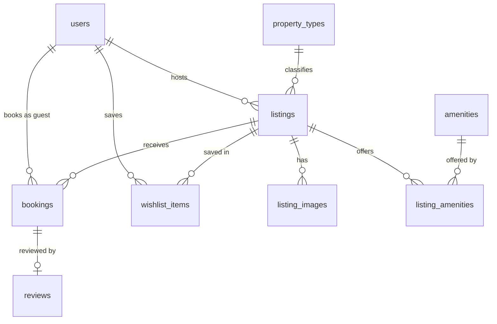

# PROJECT_PLAN.md — Airbnb Web App (SDE Fullstack Assignment)

| | |
|---|---|
| **Version** | 1.2 — final plan, ready for implementation |
| **Last updated** | 2026-10-09 |
| **Mode** | Local development first. Deployment is the last phase (§18). |
| **Next action** | Phase 1 (§15). In parallel, the product owner takes the captures listed in `docs/CAPTURE_GUIDE.md` (§5.3); the first set is needed before Phase 5. |

---

## 0. How to use this document

- This file is the source of truth for implementation. `CLAUDE.md` holds the working rules and commands. Update the checkboxes in §15 and the change log in §19 at the end of every phase.
- **Precedence when sources disagree:**
  1. The company assignment (what is graded). Scope comes from here and nowhere else.
  2. Airbnb as recorded in `docs/AIRBNB_REFERENCE.md` and in the captures (§5). They decide how every in-scope element looks and behaves.
  3. This plan. It contains no statement about Airbnb from memory (§5.1).
  4. The development-instructions document is process guidance only. It adds no features.
- Requirement IDs (`R-…`) in §2 are quoted in commits, tests and phase reports.
- Nothing outside §3 is built without a line in §19.

---

## 1. Product and non-negotiables

A marketplace that reproduces Airbnb's current web experience for the workflows the assignment names: browse and search homes, filter, view a listing, pick available dates, see a price breakdown, pay through a mocked checkout, see the booking in Trips, and, as a host, create, edit and remove listings and see their reservations. Everything persists in SQLite, and a booking blocks its dates for everyone else.

Non-negotiables:

1. **Correctness of bookings.** No double booking under any interleaving of requests; totals are computed by the server; a failed payment leaves no trace.
2. **Parity of design and behaviour.** Layout, spacing, type scale, colour, component anatomy, motion and interaction patterns follow current Airbnb, element by element (§6).
3. **Original work.** All code is written for this project. Nothing is copied from Airbnb's production bundles or from any clone repository.
4. **Its own brand, AirStay** (§5.2): its own name, mark and favicon. The Airbnb name and logo appear nowhere in the UI, and no form anywhere asks for a real password or a real card number.
5. **Explainable.** Every design decision here has a stated reason. Each phase ends with a walkthrough so the code can be defended in the interview.

---

## 2. Requirement traceability (assignment → plan)

### 2.1 Core features (must have)

| ID | Assignment requirement | Specified in | Phase |
|---|---|---|---|
| R-HS-1 | Grid of listing cards: photo, title, location, price/night, rating | §6.3, §6.5 | 5, 6 |
| R-HS-2 | Search bar: location + date range + guests | §6.4, §10.6 | 6 |
| R-HS-3 | Category / filter row: price range, property type, amenities | §6.3, §6.5, §10.6 | 6 |
| R-HS-4 | Pagination or infinite scroll | §6.3, §10.6 | 5, 6 |
| R-LD-1 | Photo gallery | §6.6 | 7 |
| R-LD-2 | Title, description, location, amenities, host info | §6.6 | 7 |
| R-LD-3 | Availability calendar / date-range picker | §6.6, §10.2 | 4 (API), 7 (UI) |
| R-LD-4 | Price breakdown: nightly rate × nights + fees | §6.6, §10.4 | 4 (API), 7 (UI) |
| R-LD-5 | Reviews section | §6.6, §10.7 | 7 |
| R-BK-1 | Select dates and guest count with validation (no overlapping/unavailable dates) | §10.1–10.3 | 4, 7, 8 |
| R-BK-2 | Booking summary and mocked checkout/confirmation | §6.7, §10.3 | 8 |
| R-BK-3 | "My Trips" view listing the user's bookings | §6.8 | 8 |
| R-BK-4 | Bookings persist and block those dates on the listing | §8, §9, §10.3 | 2, 4 |
| R-HX-1 | Create a listing: title, description, photos via URL/upload, price, location, amenities | §6.10, §10.5 | 3 (API), 9 (UI) |
| R-HX-2 | Edit and delete listings | §6.10, §10.5 | 3 (API), 9 (UI) |
| R-HX-3 | Host dashboard: owned listings and their bookings | §6.10 | 9 |
| R-HX-4 | Listing data persists | §8 | 2, 3 |
| R-AX-1 | Navigation and layout (explore grid + detail view) | §6.2–6.6 | 5–7 |
| R-AX-2 | Cards, galleries, date pickers, modals | §6 | 5–7 |
| R-AX-3 | Search, filters, pagination | §6.4, §6.5 | 6 |
| R-AX-4 | Notifications / toasts | §6.12 | 5, then every phase |
| R-AX-5 | Wishlist / favorites (can be simple) | §6.9, §10.10 | 3 (API), 5 (heart), 10 (page) |

### 2.2 Placeholders, data, deliverables

| ID | Requirement | Where |
|---|---|---|
| R-PL-1 | Mocked checkout | §6.7, §10.3 |
| R-PL-2 | Messaging: "Coming soon" | §6.11 |
| R-PL-3 | Map: a static/basic map is fine | §6.5, §6.6 (basic Leaflet map) |
| R-PL-4 | Identity verification: "Coming soon" | §6.11 |
| R-PL-5 | Auth simplified/mocked, with a notion of guest vs host | §6.1, §10.9 |
| R-SD-1 | Seeded database: varied listings with photos, several hosts, existing bookings | §12 |
| R-DB-1 | Own schema, evaluated | §8 |
| R-DOC-1 | README: setup, tech stack, architecture, schema, API overview, assumptions | Phase 1 (skeleton) → Phase 11 |
| R-DEL-1 | Public GitHub repository with `frontend/` and `backend/` | Phase 1 layout; pushed in Phase 13 |
| R-DEL-2 | Hosted, working link | Phase 13 |
| R-OW-1 | Original work | §1, §5.2 |
| R-CU-1 | Every line explainable | §16 |

### 2.3 Evaluation criteria → where the plan earns them

| Criterion | What earns it |
|---|---|
| Functionality | §10 rules with tests per rule; end-to-end journeys in §13 |
| UI/UX | §5 capture method, §6 element-by-element spec, sign-off gates in Phases 5–9 |
| Database design | §8: normalized, constraints enforced by the database, overlap trigger, price snapshots |
| Backend / API design | §11: resource-oriented REST, one error envelope, idempotent booking, server-authoritative rules |
| Code quality | Lint, type-check and build gates on every phase; small files |
| Code modularity | §7.4, §7.5: one job per layer, one home per rule |
| Code understanding | Walkthrough at the end of each phase |

---

## 3. Scope (from the assignment only)

### MUST — the assignment's core features and what they cannot work without
- Everything in §2.1 and §2.2
- Mocked identity with seeded guests and hosts, and server-side ownership checks
- Server-side validation, availability re-check and price calculation on every booking
- Loading, empty and error states on every page (§6.13)
- The parity elements that surround the core features on Airbnb's pages (header, footer, section chrome, modals), specified in §6
- A read-only profile page at `/users/profile` (§6.15), added by the product owner on 2026-10-09: the header avatar and the account menu lead to it
- Automated tests for booking, availability, search, listing CRUD and persistence (§13)
- README

### BONUS — the assignment's bonus list, attempted only after every MUST is verified, in this order
| # | Bonus | Note |
|---|---|---|
| B6 | Responsive design: mobile, tablet, desktop | First, because it is the most visible |
| B2 | Leave a review after a completed stay | Read side is MUST; this adds the write side |
| B3 | Superhost badges / rating aggregation | Aggregation is already MUST (cards need a rating); this adds the badges |
| B1 | Interactive map with listing pins | The basic map in MUST already shows pins; this adds hover/selection sync with the list |
| B4 | Image upload to cloud storage | Photo URLs satisfy R-HX-1 |
| B5 | Dark mode | Last; behind a toggle, off by default |

### PLACEHOLDER — present, not functional ("Coming soon")
Messaging; identity verification; the Experiences and Services tabs; live map behaviours (search as the map moves, live pricing).

### OUT — not in the assignment, not built
Real payments; real authentication (passwords, OAuth, phone); hotels; destination carousels; flexible-date and AI search; room and shared-room listings; request-to-book; cancelling or modifying a booking; unlisting/pausing a listing; drafts; host-blocked dates and custom pricing; editing a profile, account settings and notifications; admin; multi-currency and translation; named wishlist collections; rate limiting; database migrations tooling.

---

## 4. Decisions

### 4.1 Resolved

| ID | Decision | Resolution |
|---|---|---|
| D2 | Which Airbnb to mirror | **The current India site** (airbnb.co.in), English (IN), prices in ₹ (INR), as recorded on the dates in `docs/AIRBNB_REFERENCE.md` and the captures. The assignment names no country, language or currency, so this is OURS: reviewers in India who open "the original" see the India site. **Where the current site and the assignment clash, the assignment wins** (§4.2). |
| D3 | Removing a listing | Airbnb's rule (REF-L1): a listing cannot be permanently removed while it has upcoming reservations. Otherwise it is removed. Stored as a soft delete so past trips and reviews keep their references. |
| D4 | Login | **Mocked.** The assignment says, under "Mocked / Placeholder Sections": "Real user authentication may be simplified/mocked, but a notion of 'guest vs host' is needed". The login modal lists seeded accounts to continue as; sessions are real (signed, HttpOnly cookie). Why: authentication is not graded, a reviewer can switch between guest and host in two clicks, and no credentials are handled. |
| D5 | Brand | **AirStay.** Mark: a free open-licence icon with the wordmark (§5.2). No Airbnb name, logo, typeface files or photos. No "demo project" notice in the UI. |
| D6 | Scope | **The assignment only** (§3), with one addition by the product owner: a read-only profile page (§6.15). The development-instructions document describes process; features it mentions that the assignment does not (admin, booking cancellation, listing drafts, a sort control, editable profiles, rate limiting) are not built. |
| D7 | APIs | **Our own REST API is required** (Python backend mandated; "Backend / API Design" graded). **No third-party API**: the assignment says "you do not need to integrate with any real APIs". |
| D8 | Local first | Everything runs on one machine. Hosting is decided in Phase 13. |
| D10 | Home page | **`/` is the assignment's explore view:** search bar, filter row, grid of listing cards, pagination (R-HS-1 to R-HS-4). The current Airbnb home page is a set of destination carousels with no filters or pagination (REF-H3, REF-H8); the assignment overrides it. Search results reuse the same view with the search applied and a map beside it. |
| D11 | Pagination or infinite scroll | **Numbered pagination.** The assignment allows either; pages are addressable by URL, rendered on the server, and exactly testable. The control is styled from capture B2. |
| D12 | Evidence | **Nothing about Airbnb is taken from memory.** Every such statement cites `REF-…` (`docs/AIRBNB_REFERENCE.md`) or a capture ID (`docs/CAPTURE_GUIDE.md`). |

### 4.2 Where the assignment overrides current Airbnb

| # | Current Airbnb (evidence) | Assignment | What is built |
|---|---|---|---|
| O1 | Cards show a stay total: "₹46,740 for 2 nights" (REF-I2, REF-P1) | Card shows "price/night" | Price per night on every card; the stay total follows it when dates are chosen |
| O2 | Home is destination carousels (REF-H3); no filters, no pagination (REF-H8) | Home/explore view with grid, filter row, pagination | D10 |
| O3 | Filters sit behind a "Filters" button, with an optional "row of recommended filters" (REF-S2) | "Category / filter row (price range, property type, amenities, etc.)" | A filter row: "Filters" button plus quick filters for price, property type and amenities |
| O4 | "the details of the price can still be found in the price breakdown during checkout" (REF-P2) | Price breakdown on the listing detail page | Breakdown in the listing's booking card and again at checkout |
| O5 | Price range "Filters by total price" (REF-S2) | "price range" | Filters the nightly price, consistent with O1 |
| O6 | Several named wishlists (REF-W1) | "can be simple" | One list per user |
| O7 | Instant booking or "Request to book" (REF-B1) | Booking with mocked checkout/confirmation | Every listing books instantly: "Reserve" → "Confirm and pay" |
| O8 | Entire place, Room, Shared room (REF-L4) | Not required | Every listing is an entire place |
| O9 | Real login, real payment, photo upload | May be mocked; photos "via URL/upload" | Account picker; two saved test cards (approve / decline); photos by URL |

### 4.3 Open (does not block local development)

| ID | Decision | Needed by |
|---|---|---|
| D1 | Backend host with a persistent disk for the SQLite file (§18) | Phase 13 |
| D9 | Public repository name and commit author | Phase 13 (first push) |

---

## 5. Parity method

### 5.1 The evidence rule

Every statement in this plan about how Airbnb looks or behaves carries one of these tags.

| Tag | Meaning |
|---|---|
| **REF-xx** | Read from Airbnb's own pages; quoted with its source in `docs/AIRBNB_REFERENCE.md` |
| **CAP xx** | Defined by the capture with that ID (`docs/CAPTURE_GUIDE.md`). The plan does not describe it; the screenshot and its measurement file are the specification |
| **OURS** | A decision of this project: an assignment requirement or an engineering choice, with its reason |

Text can be verified from here; rendered pages cannot (`docs/AIRBNB_REFERENCE.md` §1). So structure, labels and rules are mostly REF, and everything visual is CAP.

Airbnb's website source is not public, and its bundles, stylesheets, fonts, icons and photos are its property. **Observe and re-implement; never copy files.** Its open-source code is not used.

### 5.2 Brand substitutions

| Airbnb | This project |
|---|---|
| The name, in any string | "AirStay" (`SITE_NAME` in `frontend/lib/config.ts`) |
| Logo | The Lucide `house` icon (open-source, ISC licence) beside the wordmark "AirStay", placed, sized and coloured like the original mark (CAP A1). One SVG file, easy to swap |
| Typeface (family names are in each measurement file's `fonts`) | **Instrument Sans**, the closest free family: chosen in Phase 5 by measuring rendered text against capture A1 (`docs/parity-notes.md`) |
| Icons | Lucide, plus hand-drawn SVGs where no close match exists |
| Photos | Free-licence photos by URL |
| Page title (REF-I4) | "AirStay: Holiday Rentals, Cabins, Beach Houses, Unique Homes & Experiences" |
| Footer links that name Airbnb products (REF-I3): "AirCover", "Airbnb your home", "Airbnb your experience", "Airbnb your service", "AirCover for Hosts", "Airbnb.org emergency stays", "2026 Summer Release" | "Guest protection", "Host your home", "Host an experience", "Host a service", "Host protection", "Emergency stays", "Release notes" |
| "© 2026 Airbnb, Inc." | "© 2026 AirStay" |
| Social links | Icons only, not linked |

Fixed whatever else changes: the Airbnb name and logo appear nowhere in the UI, and no field accepts a real password or card number (§1 point 4).

### 5.3 Captures

`docs/CAPTURE_GUIDE.md` lists the 43 captures (sets A–F), how to take them, and `tools/measure.js`, which exports exact positions, computed styles, fonts, CSS variables and link targets from the product owner's browser. Captures live in `reference/` (git-ignored). Values used are copied into `docs/parity-notes.md` (committed).

| Phase | Needs |
|---|---|
| 3–4 (backend rules) | A5, B1, B2, C2, C3 if available; otherwise the provisional values in §10 |
| 5 | Set A |
| 6 | Set B |
| 7 | Set C |
| 8 | Set D, E1 |
| 9 | Set F |
| 10 | E2–E4 |

### 5.4 Rules for implementers

1. A CAP element is built from its screenshot and measurement file, not from a description.
2. If the capture for an in-scope element is missing, build its function from the existing primitives and tokens, and list it under "pending capture" in the phase report. Do not invent Airbnb-specific appearance or behaviour.
3. If a capture contradicts a REF fact (the site changes; see REF-S4), the capture wins; record the difference in `docs/AIRBNB_REFERENCE.md`.
4. If a capture contradicts the assignment, the assignment wins (§4.2).
5. Wording follows the India site. Help Center quotes (read in US English) establish what a feature is; the spelling and labels shown on the India site and in the captures are what gets built ("Help Centre", "Guest favourite", REF-I1, REF-I2).

---

## 6. Parity specification

The desktop baseline is the window width recorded in the captures (the product owner's maximised Chrome window, the same for every capture). Narrower layouts are bonus B6.

### 6.1 Identity and modes

| Element | What is built | Evidence |
|---|---|---|
| Guest vs host | Every account can book and host. A user is a host once they own a listing. The header offers "Become a host" until then, and the switch to the hosting area afterwards | OURS (assignment: "a notion of guest vs host"); label "Become a host" REF-H1; label of the hosting switch CAP E1 |
| Login modal | Title "Log in or sign up". Body: the seeded accounts, each with avatar, name and a Guest or Host tag; choosing one signs in and resumes the interrupted action | Title REF-H1; shell CAP A7; body OURS (D4) |
| Login gate | Saving, reserving, Trips, Wishlists and hosting open the login modal when signed out, then continue | OURS |

### 6.2 Global chrome

| Element | What is built | Evidence |
|---|---|---|
| Mark and wordmark | Link to `/` | §5.2; position and size CAP A1 |
| Tabs | "All", "Homes", "Experiences", "Services". Experiences and Services open a "Coming soon" page | Labels REF-H1; active tab, icons, spacing CAP A1 |
| Search bar | "Where"; "When" with "Add dates"; "Who" with "Add guests"; search button | Labels REF-H2; layout CAP A1 |
| "Become a host" | Goes to the create-listing flow | REF-H1, REF-L5 |
| Account menu, signed out | "Log in or sign up", "Become a host", "Help Centre" (inert) | REF-I1; layout CAP A6 |
| Account menu, signed in | Wishlists, Trips, Messages (placeholder) and Profile with icons; then "Languages & currency", "Help Centre" (inert) and "Verify your identity" (placeholder); the hosting row; Switch account, Log out | Rows, order and layout CAP G2; "Switch account" and the placeholder OURS |
| Header avatar, signed in | The account's initial, dark pink on a pale pink disc; a link to `/users/profile` | CAP G1 |
| "Languages & currency" | Button present; opens a small panel showing English (IN) and ₹ INR | Label REF-I1; values REF-I3; panel OURS |
| Behaviour on scroll | As captured | CAP A2 |
| Hosting header | "Today", "Listings", and whatever else F11 shows; entries we do not build lead to "Coming soon" | "Today" REF-T2; layout CAP F11 |
| Checkout header | As captured | CAP D1 |
| Footer | Columns "Support", "Hosting" and the company column with the links of REF-I3, renamed per §5.2; bottom bar with copyright, "English (IN)", "₹ INR", "Privacy", "Terms", "Company details". Links are inert except the hosting link | REF-I3; layout CAP A1 |

### 6.3 Home / explore (`/`)

Carries R-HS-1 to R-HS-4 (D10).

| Element | What is built | Evidence |
|---|---|---|
| Search bar | §6.4 | |
| Filter row | "Filters" button with a count of active filters, and quick filters for price, property type and amenities | Assignment (O3); "Filters" label REF-S2; button and chip styling CAP B1, B5 |
| Grid | Listing cards in a responsive grid, six columns at the captured window so a page of 18 fills three rows | Assignment; card size and gaps CAP A1 on the home page, CAP B1 on search results beside the map |
| Card | Cover photo with the photo controls of B3; heart; "Guest favourite" badge (bonus B3); "{Property type} in {city}"; the listing title; "₹X per night", followed by "· ₹Y total" when dates are chosen; rating | Anatomy, type and spacing CAP B1, B3; text form "{Property type} in {place}", badge, rating and the ₹ price format REF-I2; title and price per night from the assignment (O1) |
| Rating on a card | The average, shown once a listing has three reviews; "New" before that | Threshold REF-R1; "New" OURS |
| Card click | Opens the listing page, carrying dates and guests if set | Same tab or new tab: `link.target` of the listing links in the B1 measurement file |
| Heart | Toggles saved without navigating; signed out → login | REF-W1; confirmation CAP E3 |
| Pagination | Numbered pages; state in the URL (`page`) | D11; control CAP B2 |
| Not built | "Destinations for you", "Popular homes in…", "Inspiration for future getaways", hotel sections | REF-H3; replaced by the grid (O2) |

### 6.4 Search bar

| Part | What is built | Evidence |
|---|---|---|
| Where | Free text, with suggestions drawn from the cities in our database | "type in the name of a city or search by a region" REF-S3; panel CAP A3; suggestion source OURS |
| When | A check-in / checkout range picker. Exact dates only; the "Flexible" mode is not built | REF-S2, REF-S3; calendar layout and day states CAP A4 |
| Who | Adults, children, infants, pets | Categories REF-G1, REF-S3; age text and limits CAP A5 (provisional values in §10.8) |
| Search | Goes to `/s/{location}/homes` (or `/s/homes`) in the same tab | Path form REF-H5; parameter names from `page.params` in the B1 measurement file (provisional names in §10.6) |

### 6.5 Search results (`/s/homes`, `/s/[location]/homes`)

The explore view of §6.3 with the search applied.

| Element | What is built | Evidence |
|---|---|---|
| Layout | Results and a map side by side | "Listings appear in search results and on a map" REF-S3; proportions CAP B1 |
| Heading and count | As captured | CAP B1 |
| Map | A basic Leaflet map with one marker per listing on the page; clicking a marker shows a small card linking to the listing | R-PL-3; marker and card CAP B4 |
| Filters modal | Sections, in Airbnb's order: Price range (minimum and maximum), Rooms and beds (bedrooms, beds, bathrooms), Amenities (by category), Property type. Applying writes the filters to the URL and returns to page 1 | Sections and order REF-S1; layout, controls and buttons CAP B5–B7 |
| Filter sections not built | Type of place (O8), Booking options, Top-tier stays, Accessibility features, Host language | REF-S1; no data behind them |
| No results | "No homes match your search" and a "Remove all filters" button | OURS |

### 6.6 Listing page (`/rooms/[id]`)

Path form REF-H5. Every row is laid out as captured.

| Element | What is built | Evidence |
|---|---|---|
| Photo gallery (R-LD-1) | Gallery on the page; all-photos view; single-photo view with keyboard navigation | CAP C1, C5, C6 |
| Title, description, location, amenities, host info (R-LD-2) | Each as its own section; full amenity list in a modal grouped by category | CAP C1, C7; amenity categories REF-S1 |
| Things to know | House rules, safety, cancellation policy as static text; the maximum guest count under "During your stay" | REF-B2, REF-G2, REF-X1; layout CAP C1 |
| Availability calendar (R-LD-3) | Range picker with unavailable days disabled (§10.2) | CAP C4 |
| Booking card | Dates, guests, "Reserve"; guest steppers with the capacity note | "Select dates, number of guests, then click Reserve" REF-B1; CAP C2, C3 |
| Price breakdown (R-LD-4) | In the booking card once dates are chosen: nightly price × nights, cleaning fee, service fee, total. Updates on every change of dates or guests | Assignment (O4); line layout from CAP C11 if it shows line items, otherwise the price-details block of CAP D1 |
| Reviews (R-LD-5) | Average and count, review cards, all-reviews modal | REF-R1; CAP C1, C8 |
| Location | The city and a basic map with an approximate-area marker | R-PL-3; CAP C1 |
| Sticky bar | As captured | CAP C9 |
| Share | Modal with a working "Copy link" | CAP C10; other share targets not built |
| Save | Heart, as on cards | REF-W1 |
| Reserve | Same tab to checkout; signed out → login first | OURS |
| Unknown or removed listing | 404 page | OURS |

### 6.7 Checkout and confirmation

| Element | What is built | Evidence |
|---|---|---|
| Path | `/book/stays/[listingId]` provisionally; corrected to the path in the D1 measurement file | CAP D1 |
| Layout | Trip summary, price details, payment section | CAP D1 |
| Payment method | A choice of two saved test cards: one approves, one is always declined. No card-number field | OURS (O9); selector styling CAP D2 |
| Primary button | "Confirm and pay"; disabled with a spinner while pending | Label REF-B1 |
| Success | Replace-navigate to `/trips/[bookingId]`: confirmation with "Reservation details" (confirmation code, listing, dates, guests, amount) and a toast | Assignment (R-BK-2); "Reservation details" REF-T1 |
| Declined | Inline error; selection kept; nothing booked | OURS |
| Dates taken or price changed meanwhile | Message and a way back to the listing, or the new price to confirm | OURS (§9.3) |

### 6.8 Trips (`/trips`, `/trips/[id]`)

| Element | What is built | Evidence |
|---|---|---|
| Page | "Trips": current and upcoming reservations, then "Past trips", then the cancelled-reservations section when there are any (spelling as shown in E1). Each shows listing, dates, guests, total and status | Labels REF-T1; layout CAP E1; fields from R-BK-3 |
| Reservation page | "Reservation details" with the confirmation code | REF-T1 |
| Empty | A short message and a button to start exploring | OURS; styled from CAP E1 if it shows the empty page |
| Removed listing | The trip remains, marked "Listing no longer available", without a link | OURS |

### 6.9 Wishlists (`/wishlists`)

| Element | What is built | Evidence |
|---|---|---|
| Entry | Account menu → Wishlists | "Click Menu > Wishlists" REF-W1 |
| Page | One list of saved homes as cards; the heart removes | O6; layout CAP E2 |
| Confirmation | "Saved to Wishlist" / "Removed from Wishlist" | Appearance CAP E3; wording OURS |

### 6.10 Hosting

| Element | What is built | Evidence |
|---|---|---|
| Today (`/hosting`) | Current reservations, "Upcoming", and completed ones, each with guest, listing, dates, guests and total; filter by listing | "Today", "Upcoming", listing filter REF-T2; layout CAP F11; completed list OURS (R-HX-3) |
| Listings (`/hosting/listings`) | The host's listings with status "Listed", and edit and remove actions | "Listed" REF-L3; layout CAP F12 |
| Create (`/become-a-host`) | Three steps, "Tell us about your place", "Make your listing stand out", "Finish up and publish", covering: property type, location, guests / bedrooms / beds / bathrooms; amenities, photos by URL, title, description; nightly price and cleaning fee; then "Publish". State survives a refresh; publishing makes one API call | Step names and content REF-L2; "Publish" REF-L3; screens CAP F1–F10; photo URLs O9 |
| Edit | The same fields on one page with "Save" | OURS |
| Remove | Confirmation modal. Blocked while reservations are upcoming, with the reason shown | Rule REF-L1; modal OURS |

Toasts: "Listing published", "Listing updated", "Listing removed" (OURS).

### 6.11 Placeholders ("Coming soon")

| Feature | Where |
|---|---|
| Messaging | `/messages`, linked from the account menu and from the host section of a listing |
| Identity verification | A row in the account menu |
| Experiences, Services | Header tabs |
| Any hosting navigation entry that F11 shows and §6.10 does not build | Its own "Coming soon" page |

### 6.15 Profile (`/users/profile`)

Added by the product owner on 2026-10-09; built in Phase 10 from capture G1. Read-only.

| Element | What is built | Evidence |
|---|---|---|
| Left column | "Profile" with "About me" (current) and "Connections" ("Coming soon") | CAP G1 |
| About me | The card with the user's initial, name and "Guest" or "Host"; "Edit" and "Get started" are "Coming soon" | CAP G1; Guest or Host from `is_host` |
| Reviews | "Show reviews I've written" lists the reviews that user wrote, each with its listing | CAP G1; the list OURS |
| Signed out | The login gate (§6.1) | OURS |

Until Phase 10 the avatar and the menu's Profile row lead to the not-found page.

### 6.12 Toasts

Appearance, position and duration: CAP E3. Catalogue (OURS): Saved to Wishlist · Removed from Wishlist · Link copied · Signed in as {name} · Logged out · Booking confirmed · Payment declined · Listing published · Listing updated · Listing removed · Review submitted (bonus B2) · Something went wrong, try again.

### 6.13 States (OURS)

| Page | Loading | Empty | Error |
|---|---|---|---|
| Explore and search | Skeleton cards; map placeholder | §6.5 "No results" | Inline message with retry |
| Listing | Skeleton layout | "No reviews yet" | 404 for unknown or removed; error boundary otherwise |
| Booking card | Breakdown shimmer while quoting | Prompt to choose dates | Dates unavailable / guest limit message |
| Checkout | Pending button | — | §6.7 |
| Trips, Wishlists | Skeletons | §6.8, §6.9 | Retry |
| Hosting | Skeleton rows | "Create your first listing" / "No reservations yet" | Retry |
| Any image | Grey placeholder | — | Neutral fallback tile when the URL fails |

### 6.14 Questions the captures settle

Each is recorded in `docs/parity-notes.md` when its capture arrives.

| Question | Read from |
|---|---|
| Does a listing card open in a new tab? | `link.target` of listing links in B1 |
| How many results per page? | Cards counted in B1 and B2 |
| Search and listing URL parameter names | `page.params` in B1 and C2 |
| Checkout path | `page.path` in D1 |
| Guest age text and the limit of each stepper | A5 |
| Do infants count toward a listing's maximum? | The note in C3 |
| Lines and wording of the price breakdown | C11, D1 |
| What the header does on scroll | A2 |
| Toast position and duration | E3 |
| Colours, type scale, spacing, radii, shadows, breakpoints | `rootVariables` and `style` in every measurement file |

---

## 7. System architecture

### 7.1 Shape

```
Browser
  │  all requests same-origin
  ▼
Next.js 16 (App Router)
  ├─ Server Components: first paint of public pages, fetched from the API with the user's cookie forwarded
  ├─ Client Components: everything interactive, via one typed API client
  └─ rewrite  /api/*  ──►  FastAPI (one process)  ──►  SQLite file (WAL)
```

Local: Next.js on `:3000`, FastAPI on `:8000`. The browser only ever talks to `:3000`, so cookies are first-party and there is no CORS configuration.

### 7.2 In-house vs external

| Concern | Choice |
|---|---|
| Data and business rules | In-house REST API (FastAPI) |
| Identity | In-house mock login, signed session cookie |
| Payments | In-house mock gateway module; no network call |
| Location search | In-house: substring match over seeded places; suggestions from the cities in the database. No geocoding service |
| Availability, pricing, search | In-house |
| Notifications | Toasts only; no email or SMS |
| Fonts | Self-hosted through `next/font` (fetched at build time) |
| Photos | **External:** image files by URL (Unsplash CDN), rendered through `next/image` with a fallback tile |
| Map | **External:** OpenStreetMap raster tiles through Leaflet. If tiles fail to load, the section shows the location text over a neutral panel |

Nothing in the core workflows depends on an external service being up.

### 7.3 Stack

| Layer | Choice | Why |
|---|---|---|
| Frontend | Next.js 16.x (App Router, Turbopack), React 19, TypeScript strict, Node ≥ 22.12 | Mandated; 16.x is the Active LTS line. Node floor set by Vitest 5 (§19) |
| Styling | Tailwind CSS v4; tokens as CSS variables | Precise control for pixel matching |
| Server state | TanStack Query | Caching, de-duplication, retries, optimistic wishlist |
| Calendar | react-day-picker (bundles date-fns) | Maintained, accessible range picker with disabled days; restyled to match |
| Overlays | Radix primitives (Dialog, Popover) | Focus trap, Escape, scroll lock, portals |
| Icons | lucide-react + own SVGs | |
| Map | Leaflet | Assignment allows a lightweight map library; no API key |
| Backend | Python ≥ 3.12, FastAPI, Uvicorn (one worker) | Mandated |
| ORM | SQLAlchemy 2.x, synchronous | Explicit transactions; async brings nothing on SQLite |
| Validation, settings | Pydantic v2, pydantic-settings | |
| Sessions | Starlette `SessionMiddleware` (signed cookie) | Built in, conventional |
| Python tooling | uv (lockfile, cross-platform commands), Ruff, mypy, pytest | |
| JS tooling | ESLint flat config run directly, `tsc --noEmit`, Vitest, Playwright | `next lint` no longer exists in Next.js 16 |

Version-sensitive facts to respect (checked 2026-10-09): Next.js 16 requires async `params`, `searchParams`, `cookies()` and `headers()`; `middleware.ts` is now `proxy.ts`; remote images need `images.remotePatterns`; `images.qualities` defaults to `[75]`. Next.js ships version-matched docs in `node_modules/next/dist/docs/` — read those, not memory. Pin exact versions at install and read the installed version's docs for react-day-picker and SQLAlchemy before using them.

No dependency outside this table is added without a line in §19.

### 7.4 Frontend structure and rules

```
frontend/
├── app/
│   ├── (traveling)/            layout: main header + footer
│   │   ├── page.tsx            home
│   │   ├── s/…                 search results
│   │   ├── rooms/[id]/         listing
│   │   ├── trips/, wishlists/, messages/, experiences/, services/
│   ├── (checkout)/book/stays/[listingId]/     layout: minimal header
│   ├── (hosting)/hosting/…, (hosting)/become-a-host/
│   ├── not-found.tsx, error.tsx, loading.tsx per segment
├── components/
│   ├── ui/                     button, modal, popover, toast, stepper, skeleton, pagination, image-with-fallback
│   ├── layout/                 headers, user menu, login modal, footer
│   ├── search/                 search bar, where/when/who panels, filters modal, quick filters
│   ├── listings/               listing card, grid, pagination, wishlist heart, results map
│   ├── listing/                gallery, photo tour, amenities, calendar, booking card, reviews, host card, location map
│   ├── booking/                checkout steps, summary card, price breakdown
│   ├── trips/, wishlists/
│   └── hosting/                reservations, listings table, wizard steps, listing form sections
├── lib/
│   ├── api/                    client.ts (browser), server.ts (Server Components), one file per resource
│   ├── dates.ts                ISO date helpers, selectable-day rules
│   ├── search-params.ts        search state ⇄ URL (the only place that knows parameter names)
│   ├── guests.ts               guest-count rules and summary text
│   ├── format.ts               money, ratings, date ranges
│   └── config.ts               SITE_NAME and other constants
├── hooks/                      use-current-user, use-wishlist, use-toast, use-login-gate
└── types/api.ts                types mirroring the API schemas
```

Rules:
1. **Server first.** Home, search results and the listing page are Server Components reading `searchParams`; their first paint needs no client fetch. Interactive parts are Client Components.
2. **One API client.** No component calls `fetch`. `lib/api/client.ts` sets a 10 s timeout, parses the error envelope into a typed `ApiError`, and retries only idempotent requests.
3. **The URL is the state** for search, filters, pagination, dates, guests and the photo tour. No store duplicates it.
4. **No business rules in components.** Prices come from the quote endpoint. Date and guest rules live in `lib/` and are unit-tested.
5. **Two contexts only:** current user and toasts. No global state library.
6. **No data is cached across requests** on the server (`cache: 'no-store'`): availability changes with every booking.
7. Files stay under about 200 lines; a component that grows past that is split.

### 7.5 Backend structure and rules

```
backend/
├── pyproject.toml, uv.lock
├── app/
│   ├── main.py                 app factory, middleware, routers, exception handlers
│   ├── core/                   config.py, errors.py, logging.py, deps.py, clock.py
│   ├── db/                     engine.py (pragmas, BEGIN control), session.py (read/write units of work), base.py
│   ├── users/                  models, schemas, router (auth), service
│   ├── listings/               models, schemas, router, service, repository
│   ├── bookings/               models, schemas, router, service, repository, availability.py, pricing.py, guests.py, payment.py
│   ├── reviews/                models, schemas, router, service
│   ├── wishlist/               models, schemas, router, service
│   └── seed/                   data and loader
└── tests/
```

Rules:
1. **router** (HTTP shapes, status codes, auth dependencies) → **service** (business rules; owns the transaction) → **repository** (queries) → **models**. A repository exists only where queries are non-trivial (listing search, booking overlap).
2. **One home per rule.** Overlap: `bookings/availability.py`. Money: `bookings/pricing.py`. Today's date: `core/clock.py` (injectable in tests). Removed-listing filter: the listings repository's base query.
3. Services raise `AppError(code, status, message)`. One handler renders the envelope (§11.1). Unknown exceptions become a 500 envelope with a request id; the stack trace goes to the log only.
4. Every request gets a request id (header in, header out, in every log line). Booking logs one line per step of §10.3 at INFO.
5. Routers never touch the session; services never build HTTP responses.

### 7.6 Configuration

| Variable | Used by | Local default |
|---|---|---|
| `DATABASE_URL` | backend | `sqlite:///./data/app.db` |
| `SECRET_KEY` | backend (signs the session cookie) | generated into `.env` by the setup script |
| `SERVICE_FEE_BPS` | backend | `1500` |
| `APP_TIMEZONE` | backend | `Asia/Kolkata` |
| `SEED_ON_EMPTY` | backend | `false` locally (seed is an explicit command) |
| `COOKIE_SECURE` | backend | `false` locally; `true` in production, so the session cookie is sent over HTTPS only |
| `BACKEND_URL` | frontend, server side only | `http://localhost:8000` |

`.env` files are git-ignored; `.env.example` is committed. `SECRET_KEY` is the only secret.

### 7.7 Commands (root `package.json`, cross-platform)

| Command | Does |
|---|---|
| `npm run setup` | `uv sync` in `backend/`, `npm install` in `frontend/`, creates `.env` files |
| `npm run seed` | Rebuilds the database from the models and loads the seed |
| `npm run dev` | Runs backend and frontend together |
| `npm run test` | pytest and Vitest |
| `npm run check` | Ruff, mypy, pytest, ESLint, `tsc --noEmit`, Vitest, `next build` |
| `npm run e2e` | Playwright against a freshly seeded stack |

---

## 8. Database design



### 8.1 Tables

**users**

| Column | Type | Constraints |
|---|---|---|
| id | INTEGER | PK |
| name | TEXT | NOT NULL, non-empty |
| email | TEXT | NOT NULL, UNIQUE |
| avatar_url | TEXT | |
| bio | TEXT | |
| is_demo | BOOLEAN | NOT NULL, default false — offered in the login modal |
| created_at | DATETIME (UTC) | NOT NULL — "years hosting" derives from it |

"Host" is not a column: a host is a user with at least one listing (§6.1).

**property_types** — id PK; slug UNIQUE NOT NULL; name NOT NULL. Reference data: house, apartment, guesthouse, cabin, villa, cottage, tiny home, treehouse.

**amenities** — id PK; slug UNIQUE NOT NULL; name NOT NULL; category NOT NULL CHECK IN (bathroom, bedroom_laundry, entertainment, family, heating_cooling, home_safety, internet_office, kitchen_dining, location, outdoor, parking_facilities) — the amenity groups Airbnb's filters use (REF-S1).

**listings**

| Column | Type | Constraints |
|---|---|---|
| id | INTEGER | PK |
| host_id | INTEGER | NOT NULL, FK → users (RESTRICT) |
| property_type_id | INTEGER | NOT NULL, FK → property_types (RESTRICT) |
| title | TEXT | NOT NULL, non-empty |
| description | TEXT | NOT NULL, non-empty |
| city, country | TEXT | NOT NULL |
| state | TEXT | nullable |
| latitude, longitude | REAL | nullable; CHECK ranges; both set or both null |
| price_per_night_minor | INTEGER | NOT NULL, CHECK > 0 |
| cleaning_fee_minor | INTEGER | NOT NULL, default 0, CHECK ≥ 0 |
| max_guests | INTEGER | NOT NULL, CHECK ≥ 1 |
| bedrooms | INTEGER | NOT NULL, CHECK ≥ 0 |
| beds, bathrooms | INTEGER | NOT NULL, CHECK ≥ 1 |
| pets_allowed | BOOLEAN | NOT NULL, default false — whether guests may bring pets (§10.8) |
| created_at, updated_at | DATETIME (UTC) | NOT NULL |
| deleted_at | DATETIME (UTC) | nullable — set when the host removes the listing (D3) |

**listing_images** — id PK; listing_id FK → listings (CASCADE); url NOT NULL; position NOT NULL CHECK ≥ 0; UNIQUE (listing_id, position). Position 0 is the cover.

**listing_amenities** — listing_id FK → listings (CASCADE); amenity_id FK → amenities (RESTRICT); PK (listing_id, amenity_id).

**bookings**

| Column | Type | Constraints |
|---|---|---|
| id | INTEGER | PK |
| confirmation_code | TEXT | NOT NULL, UNIQUE |
| listing_id | INTEGER | NOT NULL, FK → listings (RESTRICT) |
| guest_id | INTEGER | NOT NULL, FK → users (RESTRICT) |
| check_in, check_out | DATE | NOT NULL; CHECK each is a valid ISO date; CHECK check_out > check_in |
| adults | INTEGER | NOT NULL, CHECK ≥ 1 |
| children, infants, pets | INTEGER | NOT NULL, default 0, CHECK ≥ 0 |
| nightly_price_minor | INTEGER | NOT NULL, CHECK > 0 — price snapshot |
| cleaning_fee_minor, service_fee_minor | INTEGER | NOT NULL, CHECK ≥ 0 — snapshots |
| total_minor | INTEGER | NOT NULL; CHECK total = nightly × nights + cleaning + service |
| status | TEXT | NOT NULL, default confirmed, CHECK IN (confirmed, cancelled) |
| payment_reference | TEXT | NOT NULL — returned by the (mock) gateway |
| idempotency_key | TEXT | NOT NULL; UNIQUE (guest_id, idempotency_key) |
| created_at | DATETIME (UTC) | NOT NULL |

In SQLite the date CHECK is `check_in IS date(check_in)` (likewise `check_out`), and nights inside the total CHECK is `CAST(julianday(check_out) - julianday(check_in) AS INTEGER)`. Use `IS`, not `=`: `date()` returns NULL for a malformed value, and a CHECK that evaluates to NULL passes. These constraints, both triggers and the write-lock behaviour were tried on SQLite 3.45 while writing this plan (the §10.1 fixture table behaved as specified; eight simultaneous bookings produced one success and seven conflicts). Phase 2 turns that into permanent tests.

**Integer columns are really integers.** SQLite stores any value in any column: an INTEGER column keeps the text `'abc'` as text, and `'abc' > 0` is true there, so a range CHECK alone can be bypassed. Every integer column that has a range or comparison CHECK therefore also has `CHECK (typeof(col) = 'integer')`: the money columns, guest counts, room counts, `rating` and the image `position`. Whole numbers written as text (`'4'`) are still accepted, because the column's affinity converts them before the check runs.

**reviews** — id PK; booking_id NOT NULL UNIQUE FK → bookings (RESTRICT); rating NOT NULL CHECK 1–5; comment NOT NULL, non-empty; created_at. The listing and the author are reached through the booking, so a review cannot exist without a stay and cannot disagree with it.

**wishlist_items** — user_id FK → users (CASCADE); listing_id FK → listings (CASCADE); created_at; PK (user_id, listing_id).

### 8.2 Indexes

| Index | Serves |
|---|---|
| listings (host_id) | Host dashboard |
| listings (city), (property_type_id), (price_per_night_minor) | Search filters |
| listing_amenities (amenity_id, listing_id) | Amenity filter |
| bookings (listing_id, check_in, check_out) WHERE status = 'confirmed' | Overlap check, availability, search by dates |
| bookings (guest_id, check_in) | Trips |
| wishlist_items (listing_id) | Cascade and counts |

### 8.3 The no-double-booking invariant, enforced by the database

SQLite has no exclusion constraint, so the invariant is enforced twice: by the service inside a write-locked transaction (§10.3), which produces clean errors, and by triggers, which make it impossible for any code path, script or manual SQL to break it. SQLite allows one writer at a time, so a trigger's check and the insert it guards cannot interleave with another write.

```sql
CREATE TRIGGER bookings_no_overlap_insert
BEFORE INSERT ON bookings
WHEN NEW.status = 'confirmed'
BEGIN
  SELECT RAISE(ABORT, 'booking_overlap')
  WHERE EXISTS (
    SELECT 1 FROM bookings b
    WHERE b.listing_id = NEW.listing_id
      AND b.status = 'confirmed'
      AND b.check_in < NEW.check_out
      AND NEW.check_in < b.check_out
  );
END;
```

A second trigger, `BEFORE UPDATE OF listing_id, check_in, check_out, status`, applies the same test with `b.id <> NEW.id`. Both are created by a DDL event attached to the bookings table, so `create_all` and the tests always have them.

### 8.4 Design notes (interview material)

- **Normalized.** No derived value is stored: ratings and review counts are aggregated at read time; "upcoming / current / completed" derive from dates; host status derives from listings.
- **The one intentional redundancy is the price snapshot on a booking.** It is a historical fact (what was charged), not a copy of the listing's current price, and a CHECK keeps the stored lines and total consistent with each other.
- **Money is an integer in the currency's minor unit (paise; ₹1 = 100).** No floating point touches money. Every amount is a whole number of rupees (§10.4), so every displayed line adds up exactly.
- **Dates are ISO text** (`YYYY-MM-DD`), which sorts and compares correctly as strings in SQLite; CHECKs reject malformed values.
- **Soft delete only where history requires it** (listings). Everything else uses real foreign keys with RESTRICT or CASCADE chosen per relationship.
- **Reference data in tables** (property types, amenities), so integrity is by foreign key and the UI lists come from the API.
- **Schema is created from the models** (`create_all`); there is one schema version, rebuilt by the seed command. Migrations tooling is out of scope.

---

## 9. Transactions, concurrency and failure handling

### 9.1 Connection settings (asserted by a test)

`journal_mode = WAL` · `foreign_keys = ON` · `synchronous = FULL` · `busy_timeout = 5000 ms`.

### 9.2 ACID, concretely

| Property | How it is achieved |
|---|---|
| Atomicity | One transaction per request (unit of work in a dependency: commit on success, roll back on any exception). A listing with its photos and amenities, or a booking with its payment, is written entirely or not at all |
| Consistency | Foreign keys, CHECK and UNIQUE constraints and the overlap triggers are enforced by the database for every writer |
| Isolation | WAL gives readers a consistent snapshot and never blocks them. Every mutating request opens with `BEGIN IMMEDIATE`, taking the single write lock before reading anything, so writes are serializable |
| Durability | With `synchronous = FULL` a commit is flushed to disk before the API answers |

Why `BEGIN IMMEDIATE` and not the default deferred `BEGIN`: with a deferred transaction two requests can both read "dates are free" before either writes, and a read transaction that later tries to write can fail at once instead of waiting. Taking the write lock first removes both problems.

Implementation: two session dependencies, `read_session` (deferred) and `write_session` (immediate). Python's `sqlite3` driver manages `BEGIN` itself by default; `db/engine.py` follows SQLAlchemy's documented recipe for taking control of it. **Phase 1 proves this with a test** before anything is built on it.

### 9.3 Race conditions and their resolution

| # | Scenario | Resolution |
|---|---|---|
| 1 | Two guests book overlapping dates at the same moment | Write lock serializes them; the second sees the first booking and gets 409 `dates_unavailable`. The trigger is the backstop |
| 2 | Double click, or a network retry of the same checkout | `Idempotency-Key`: the second request returns the first booking instead of creating another or failing |
| 3 | Host changes the price while a guest is checking out | The booking reads the price inside its write transaction. The request carries the total the guest saw (`expected_total_minor`); if the server's total differs it answers 409 `price_changed` with the new quote, and the UI asks the guest to confirm again |
| 4 | Host removes a listing while a guest is booking it | Serialized. Whichever commits first wins: the booking then gets 404, or the removal gets 409 |
| 5 | Guest's calendar is stale | The server re-checks; 409; the UI refetches availability |
| 6 | Heart clicked twice quickly | `PUT`/`DELETE` are idempotent on the composite primary key |
| 7 | Two reviews for one stay | UNIQUE (booking_id) → 409 |
| 8 | Host edits one listing in two tabs | Last write wins per field; photo and amenity sets are replaced atomically. Accepted and documented |
| 9 | Write lock not obtained within the busy timeout | 503 `busy` with `Retry-After: 1`; the client retries idempotent requests twice with backoff (§9.4) |
| 10 | Process dies mid-transaction | WAL recovery discards the uncommitted transaction on the next open |

### 9.4 Failure handling

| Layer | Behaviour |
|---|---|
| API | Typed `AppError` → envelope. Validation errors → 422 with field paths. Unknown exception → 500 envelope with request id, full trace in the log. `/api/health` runs a query |
| API client | 10 s timeout. GET, PUT and DELETE retried twice with backoff on network errors and 503; POST never retried automatically, except the booking POST, which is safe because of its idempotency key |
| Pages | `error.tsx` boundary per route segment with a retry action; `not-found.tsx`; `loading.tsx` skeletons |
| Images and map | Fallback tile; map section degrades to text (§7.2) |
| Mutations in the UI | Buttons disabled while pending; optimistic updates (wishlist) roll back with a toast on failure; forms keep their values on error |

---

## 10. Business rules

### 10.1 Dates — one rule used everywhere

- A stay is the half-open interval **[check_in, check_out)**. `nights = check_out − check_in`.
- Two stays overlap exactly when `a.check_in < b.check_out AND b.check_in < a.check_out`.
- Only `confirmed` bookings block dates.
- `availability.py` exposes this once as a Python predicate and as a SQL expression built from the same definition.

Against an existing booking Oct 10 → Oct 15 (this table is the unit-test fixture, on both backend and frontend):

| Request | Result |
|---|---|
| Oct 15 → Oct 20 | allowed (starts on the check-out day) |
| Oct 5 → Oct 10 | allowed (ends on the check-in day) |
| Oct 14 → Oct 16 | conflict |
| Oct 9 → Oct 11 | conflict |
| Oct 11 → Oct 13 | conflict (inside) |
| Oct 8 → Oct 18 | conflict (contains) |

- **Bookable window:** check-in from today, check-out at most 730 days ahead, minimum one night. Airbnb allows booking "up to 2 years in advance" (REF-A1).
- **Today** comes from `core/clock.py`: the current date in `APP_TIMEZONE` (default `Asia/Kolkata`). The server accepts a check-in from one day before that, so a visitor in a timezone behind India can still book their local today; the client limits selection to the browser's local today.

### 10.2 Availability and the calendar

- `GET /api/listings/{id}/availability?from=&to=` returns the confirmed booked ranges intersecting the window (default today → +730 days) as `[{check_in, check_out}]`. It never says who booked.
- Selectable days, implemented once in `lib/dates.ts`:
  - **Check-in:** not in the past, inside the window, and not inside any booked range.
  - **Check-out**, once check-in `c` is chosen: any day `d > c` up to and including the next booked check-in after `c`. A booked check-in day is therefore a valid check-out for the stay before it.
- The calendar is a convenience; the server decides.

### 10.3 Creating a booking — `POST /api/bookings`

Header: `Idempotency-Key` (UUID, generated once per checkout page load).
Body: `listing_id`, `check_in`, `check_out`, `adults`, `children`, `infants`, `pets`, `payment_method`, `expected_total_minor`. No user id.

| # | Step | On failure |
|---|---|---|
| 1 | Resolve the session user | 401 `unauthenticated` |
| 2 | Validate shape, types and the idempotency key | 422 `validation_error` |
| 3 | `BEGIN IMMEDIATE` | 503 `busy` |
| 4 | Look up (guest, idempotency key). Found with the same payload → return that booking (200). Found with a different payload → | 422 `idempotency_key_reused` |
| 5 | Load the listing; must exist and not be removed | 404 `listing_not_found` |
| 6 | Guest is not the host | 403 `cannot_book_own_listing` |
| 7 | Dates valid (§10.1) | 422 `invalid_dates` |
| 8 | Guests valid (§10.8) | 422 `invalid_guest_count` |
| 9 | No confirmed booking overlaps | 409 `dates_unavailable` |
| 10 | Compute the price (§10.4); it equals `expected_total_minor` | 409 `price_changed` (response carries the new quote) |
| 11 | Charge through the payment gateway interface | 402 `payment_declined` |
| 12 | Insert the booking with snapshots, payment reference and confirmation code; commit | — |
| 13 | 201 with the booking | |

Any failure from step 4 on rolls the transaction back; nothing is persisted.

- `payment.py` defines a small `PaymentGateway` interface and a `MockGateway` (`demo_card_ok` succeeds, `demo_card_declined` raises). The service depends on the interface.
- **Trade-off to be able to explain:** the charge happens while the write lock is held, which is correct only because the mock is instant. With a real gateway the flow would be: place a short-lived hold on the dates → release the lock → charge → confirm or release the hold.
- The client's total is never used to charge; it is only compared.

### 10.4 Pricing — `bookings/pricing.py`, the only place money is calculated

```
nights_total = nightly_price_minor × nights
cleaning_fee = listing.cleaning_fee_minor                       (flat, per stay)
service_fee  = (nights_total + cleaning_fee) × SERVICE_FEE_BPS / 10000, rounded half-up to a whole rupee
total        = nights_total + cleaning_fee + service_fee
```

Integer arithmetic throughout, in paise: `service_fee = (((nights_total + cleaning_fee) × bps + 500_000) // 1_000_000) × 100`.
Example: ₹4,500 × 5 nights = ₹22,500; cleaning ₹1,200; service fee 15% of ₹23,700 = ₹3,555; total ₹27,255.
Amounts are shown in rupees without decimals, formatted for `en-IN` (`lib/format.ts`); the exact form follows the captures (REF-I2 shows "₹46,740").
The 15% rate is OURS; for comparison, Airbnb's guest fee under its split-fee structure is 14.1%–16.5% of the booking subtotal (REF-P3).

- `GET /api/listings/{id}/quote?check_in=&check_out=&adults=&children=&infants=&pets=` runs validations 5 and 7–9 of §10.3 and returns the breakdown. The booking card and checkout render the quote; the frontend never multiplies prices.
- Search results use the same function for the "total" under each card when dates are set.

### 10.5 Listings (host CRUD)

| Field | Rule |
|---|---|
| title | 5–80 characters after trimming |
| description | 1–5000 characters |
| property_type | an existing property type |
| city, country | required; state optional |
| price per night | whole rupees, ₹500–₹5,00,000 (stored in paise) |
| cleaning fee | whole rupees, ₹0–₹25,000 (stored in paise) |
| max_guests / bedrooms / beds / bathrooms | 1–16 / 0–20 / 1–30 / 1–20 |
| pets_allowed | boolean; false when omitted |
| photos | 1–20 URLs, `https` only, at most 2,000 characters each, order kept, first is the cover. Five or more recommended |
| amenities | existing amenity slugs; duplicates dropped |

- **Create:** any signed-in user; `host_id` is the session user. The body cannot set it.
- **Update (`PATCH`):** owner only, partial. Sending `photos` or `amenities` replaces the whole set in the same transaction. Price changes never touch existing bookings.
- **Remove (`DELETE`):** owner only. 409 `listing_has_upcoming_reservations` if any confirmed booking has `check_out > today`. Otherwise `deleted_at` is set and wishlist entries for it are deleted. A removed listing returns 404, is absent from search, home, hosting and wishlists, and remains visible on past trips as "no longer available".
- Host-created listings have no coordinates; their map sections show the city text panel instead (limitation, documented in the README).

### 10.6 Search and filters — `GET /api/listings`

| Parameter | Semantics |
|---|---|
| `location` | Split on commas; each part must match city, state or country (case-insensitive substring; wildcard characters escaped). Empty = everywhere |
| `check_in`, `check_out` | Both or neither, valid per §10.1. Keeps listings with no confirmed booking overlapping the range |
| `adults`, `children`, `infants`, `pets` | `max_guests ≥ adults + children`. `pets > 0` keeps listings whose `pets_allowed` is true |
| `min_price_minor`, `max_price_minor` | Inclusive bounds on the nightly price; `min > max` → 422 |
| `property_type` | Repeatable slug; any of (OR) |
| `amenity` | Repeatable slug; listing must have all (AND) |
| `min_bedrooms`, `min_beds`, `min_bathrooms` | Lower bounds |
| `page`, `page_size` | 1-based; default 18 (captures B1 and B2), maximum 50 (OURS). A page past the end returns an empty `items` list |

- Filter groups combine with AND. Contradictory filters return 200 with no items.
- Order is fixed and total: newest first (`id DESC`), so pages never overlap or skip.
- Response: `{ items, page, page_size, total, total_pages }`. Each item carries everything a card needs (cover and up to five photos, property type, city, title, beds, bedrooms, price, rating average, review count, coordinates, and `stay_total_minor` when dates are given) from **one query plus one photos query** (after a count for `total`), never one query per card.
- `GET /api/listings/summary` takes the same filters and returns `{ total, price_min_minor, price_max_minor, histogram }` for the filters modal. `total` honours every filter; the histogram ignores the price bounds, and the UI draws it only if capture B5 shows one.
- `GET /api/locations?q=` returns up to eight suggestions with listing counts for the Where panel. Each suggestion is a city, a state or a country, and is matched on its own name by word prefix: "ma" offers Manali (a city) and "Maharashtra, India" (a state), not Mumbai or Shimla. Its `label` is what is shown and what is sent back as `location`. Without a query, the busiest cities are returned.
- `lib/search-params.ts` is the single translator between the page URL and the API. Page-URL parameter names follow the captures where they are known: on the search page `checkin`, `checkout` and `adults` (CAP B1); on the listing page `check_in`, `check_out` and `adults` (CAP C2). The rest stay provisional until B5–B7 are read (`children`, `infants`, `pets`, `price_min`, `price_max`, `property_type`, `amenities`, `min_bedrooms`, `min_beds`, `min_bathrooms`), and `page` is ours (D11). The API's own parameter names do not change; only this module translates.

### 10.7 Reviews and ratings

- **Read (MUST):** average to two decimals and count per listing; paginated review list (author name, avatar, month and year, rating, comment). A listing's rating is shown once it has three reviews (REF-R1); before that, cards show "New" (OURS).
- **Write (bonus B2):** `POST /api/bookings/{id}/review` — only the booking's guest, only when the booking is confirmed, `check_out ≤ today` and no more than 14 days have passed since checkout (REF-R1), once per booking. Rating 1–5; comment 1–2000 characters.
- **Badges (bonus B3):** "Guest favourite" when a listing has at least five reviews (REF-R2) averaging ≥ 4.9 (OURS; Airbnb publishes no number). "Superhost" when a host has at least 10 completed stays and an overall rating of 4.8 or higher (REF-R3; response and cancellation rates are not modelled). Derived, not stored.

### 10.8 Guests

- Categories: adults, children, infants, pets (REF-G1).
- `guests = adults + children`. Children count toward a listing's maximum (REF-G1).
- From the captures (`docs/parity-notes.md`): at most 16 guests in a search (CAP A5); infants do not count toward a listing's maximum (CAP C3); at most 5 infants (CAP A5). Still provisional (OURS), because no capture shows them: at most 5 pets; pets do not count toward the maximum; at least one adult. Pets only where the listing's `pets_allowed` is true.
- Valid when `adults ≥ 1`, `guests ≤ listing.max_guests` and the limits above hold.
- The limits are named constants in one module on each side (`bookings/guests.py`, authoritative; `lib/guests.ts`, to disable steppers) and are served by `/api/meta`, so the captures change values, not code.

### 10.9 Identity and authorization

- `POST /api/auth/login { user_id }` accepts only `is_demo` users and writes the user id into the signed session cookie (HttpOnly, SameSite=Lax, Secure in production, 14 days).
- `current_user` resolves the cookie to a user row (missing → anonymous; unknown id → session cleared). `require_user` guards endpoints.
- Ownership is always derived from the session: a guest sees only their bookings; a host sees and changes only their listings and the reservations on them; a booking is visible to its guest and to the listing's host, and is 404 to anyone else.
- Cross-site request forgery: the session cookie is SameSite=Lax and every state change uses POST, PUT, PATCH or DELETE, which browsers do not send cross-site with such a cookie.

### 10.10 Wishlist

One list per user. `PUT` and `DELETE /api/wishlist/{listing_id}` are idempotent. `GET /api/wishlist/ids` lets the client mark hearts without making listing responses user-specific.

---

## 11. API contract

### 11.1 Conventions

- Base path `/api`. JSON, `snake_case`. Dates `YYYY-MM-DD`. Money as integers in minor units (paise) with `currency: "INR"`.
- Identity by session cookie only.
- Every error has one shape:

```json
{ "error": { "code": "dates_unavailable", "message": "Those dates are no longer available.", "details": {}, "request_id": "…" } }
```

| Status | Meaning |
|---|---|
| 200 / 201 / 204 | OK / created / no content |
| 401 | Sign-in required |
| 402 | Mock payment declined |
| 403 | Signed in but not allowed |
| 404 | Missing, removed, or not visible to this user |
| 409 | Conflict with current state (dates taken, price changed, upcoming reservations, already reviewed) |
| 422 | Invalid input |
| 503 | Busy; retry |

### 11.2 Endpoints

| Method | Path | Who | Purpose |
|---|---|---|---|
| GET | `/api/health` | anyone | Liveness, including a database query |
| GET | `/api/meta` | anyone | Property types, amenities by category, fee rate, guest limits |
| GET | `/api/auth/demo-accounts` | anyone | Accounts shown in the login modal |
| POST | `/api/auth/login` | anyone | Start a session as a demo account |
| POST | `/api/auth/logout` | anyone | End the session |
| GET | `/api/auth/me` | anyone | `{ user }` with `is_host`, or `{ user: null }` |
| GET | `/api/locations` | anyone | Where-panel suggestions |
| GET | `/api/listings` | anyone | Search (§10.6) |
| GET | `/api/listings/summary` | anyone | Count, price bounds, histogram |
| POST | `/api/listings` | user | Create |
| GET | `/api/listings/{id}` | anyone | Detail: photos, amenities, host summary, rating, review count |
| PATCH | `/api/listings/{id}` | owner | Update |
| DELETE | `/api/listings/{id}` | owner | Remove (§10.5) |
| GET | `/api/listings/{id}/availability` | anyone | Booked ranges |
| GET | `/api/listings/{id}/quote` | anyone | Price breakdown |
| GET | `/api/listings/{id}/reviews` | anyone | Paginated reviews |
| POST | `/api/bookings` | user | Create a booking (§10.3) |
| GET | `/api/bookings` | user | The caller's trips |
| GET | `/api/bookings/{id}` | its guest or the listing's host | Reservation detail |
| GET | `/api/hosting/listings` | user | The caller's listings |
| GET | `/api/hosting/reservations` | user | Reservations on the caller's listings, including listings removed since (marked `removed`); `status` (`upcoming`, `current`, `past`, `cancelled`) and `listing_id` filters. Empty for a user who has never hosted |
| GET | `/api/wishlist` | user | Saved listings as cards |
| GET | `/api/wishlist/ids` | user | Saved listing ids |
| PUT / DELETE | `/api/wishlist/{listing_id}` | user | Save / unsave |
| POST | `/api/bookings/{id}/review` | its guest | Bonus B2 |

FastAPI's generated `/docs` is the detailed reference; the README carries this overview.

---

## 12. Seed data

`npm run seed` rebuilds the database and loads the seed. A fixed random seed makes the content identical on every run; bookings are placed relative to the run date so there are always past, current and upcoming stays.

| Data | Amount and purpose |
|---|---|
| Users | 34. Seven demo accounts for the login modal: four hosts (two with six listings each, one with one, one with one nearly fully booked next month) and three guests (one with past and upcoming trips, one with only past trips, one with none). Fourteen further hosts who are not demo accounts, with 7–8 listings each; no host owns more than 8. The remaining 13 only author past stays and reviews. `avatar_url` is empty for all of them |
| Property types, amenities | 8 and about 30, spread over Airbnb's amenity groups (REF-S1) |
| Listings | 120 (seven pages at the default size of 18). Goa has 40 over four towns (Candolim, Anjuna, Calangute, Palolem), Manali and Jaipur 20 each, so a search for any of them needs pagination; nine other destinations have 4–5 each (Udaipur, Munnar, Coorg, Rishikesh, Mumbai, Bengaluru, Darjeeling, Shimla, Alappuzha). Every property type, named as the India site names them on cards ("Home", "Flat", "Villa", "Tiny home", …), prices about ₹1,500–₹60,000 a night, capacity 1–12; spread over 18 hosts, each host's homes in more than one city; about a third allow pets |
| Photos | At least five per listing from a curated pool; two listings with three photos to exercise the gallery fallback. Every listing has a cover of its own, used nowhere else: the outside views by property type, and 36 interior photos set aside as covers for flats, guesthouses and homes. Gallery photos may repeat across listings, never within one |
| Past bookings and reviews | Most listings have 3–40 reviews; a few have fewer than three ("New") |
| Upcoming bookings | About 30, including a back-to-back pair and one listing almost fully booked next month |
| Cancelled booking | One, proving that cancelled stays do not block dates |

- **No photo URL is invented.** Each is collected from a free-licence source and verified by `npm run seed -- --check-images`, which requests every URL.
- The seed is inserted through the same pricing module as real bookings, and the seed tests assert every invariant (§13).

---

## 13. Testing

Acceptance criteria and test names are written before each phase's implementation.

| Layer | Tool | Proves |
|---|---|---|
| Backend integration | pytest + TestClient, a fresh temporary SQLite file per test | Real HTTP against the real app and database: every endpoint, every error code |
| Backend unit | pytest | Overlap table (§10.1), pricing and rounding, guest rules, location matching |
| Database | pytest | Each constraint rejects bad rows; the overlap triggers reject a conflicting row inserted with raw SQL; pragmas are set |
| Concurrency | pytest, 8 threads | Simultaneous bookings for the same dates → exactly one 201, the rest 409; same idempotency key → one booking |
| Persistence | pytest | Write, dispose the engine, reopen → data present |
| Seed | pytest | No overlapping confirmed bookings; totals equal the pricing module; `PRAGMA foreign_key_check` and `integrity_check` clean |
| Frontend unit | Vitest | `dates.ts` selectable-day rules (same fixture table), `search-params.ts` round trip, `guests.ts`, formatters |
| End to end | Playwright, freshly seeded stack | Journeys J1–J5 below |
| Manual parity | Side-by-side with the captures | Each phase's sign-off |

**Journeys**

| ID | Journey |
|---|---|
| J1 | Guest opens home → searches a city, dates and guests → applies a filter → opens a listing → picks dates → sees the breakdown → reserves → pays with the demo card → sees the confirmation → finds the booking in Trips after a reload |
| J2 | Host creates a listing through the wizard → it appears in hosting and in search → edits the price → the listing page shows the new price → removes it → it is gone from search |
| J3 | Guest A books dates → Guest B sees them disabled → B's direct API call for overlapping dates gets 409 → a booking starting on A's check-out day succeeds → the host sees both reservations |
| J4 | Guest saves a listing → toast → it is in Wishlists → unsaves → toast → gone |
| J5 | Guest pays with the declined demo card → error shown, nothing booked, dates still free |

**Edge cases that must each have a test:** equal, reversed, past and out-of-window dates; zero, negative, over-capacity and at-capacity guests; pets on a listing that does not allow them; unknown and removed listing ids; missing fields, invalid price, no photo, non-https photo URL, unknown amenity; duplicate submission; stale availability; price changed since the quote; declined payment; booking one's own listing; viewing someone else's booking; editing or removing someone else's listing; removing a listing with an upcoming reservation; zero results; contradictory filters; `min > max`; page past the end; `page_size` over the cap.

---

## 14. Security and data integrity

| Principle | Implementation |
|---|---|
| Validate on the server | Pydantic schemas on every input; business checks in services; database constraints behind both |
| Ownership from the session | `host_id` and `guest_id` are never read from a request body |
| Client totals and availability are not trusted | Recomputed and re-checked inside the write transaction |
| Parameterized SQL only | SQLAlchemy expressions; `LIKE` input escaped; the only raw SQL is the static trigger DDL |
| Safe rendering | React escapes text; no `dangerouslySetInnerHTML`; photo URLs restricted to `https` |
| Session cookie | Signed, HttpOnly, SameSite=Lax, Secure in production |
| No sensitive data collected | No passwords, no card numbers (§1 point 4) |
| Bounded inputs | Length limits on every string, caps on page size and photo count |
| Known, documented gap | Login is a demo-account picker (allowed by the assignment); anyone can use any demo account |

---

## 15. Phases

One phase at a time: restate scope → write acceptance tests → implement → `npm run check` → verify by hand → report (§16) → commit → tick the box here. Backend phases 1–4 need no captures; UI phases 5–9 each end with a side-by-side sign-off by the product owner.

### [x] Phase 1 — Foundation
Repository layout (`frontend/`, `backend/`, root scripts, `.gitignore` including `reference/` and `data/`); FastAPI app factory, settings, engine with pragmas and `BEGIN` control, read and write sessions, error envelope, request-id logging, `/api/health`; Next.js scaffold with TypeScript strict, Tailwind, ESLint flat config, the `/api` rewrite, both API clients; README skeleton.
- [x] `npm run setup`, `dev` and `check` work from a clean clone
- [x] `GET /api/health` answers on `:8000` and through `:3000`
- [x] Tests: pragmas set; a write session holds the write lock (a second writer waits, then gets 503 after the timeout); unknown route and unhandled exception both return the envelope

### [x] Phase 2 — Schema and seed
- [x] Every table, constraint, index and trigger in §8
- [x] Database tests for each constraint and both triggers (raw SQL inserts)
- [x] `npm run seed` produces §12; two runs on the same day are identical; seed tests pass; image check passes
- [x] README schema section with the ER diagram

### [x] Phase 3 — Identity, catalogue, host CRUD, wishlist API
Auth endpoints and dependencies; `/api/meta`; `/api/locations`; `GET /api/listings` (all filters except dates); `/api/listings/summary`; listing detail; reviews read; create, update, remove; `/api/hosting/listings`; wishlist endpoints.
- [x] Tests for every rule in §10.5, §10.6 (minus dates), §10.9, §10.10 and the matching edge cases in §13
- [x] Query-count test: a page of search results issues a fixed, small number of queries
- [x] Page size and guest limits are single named constants, set from captures A5, B1 and B2 if they have arrived

### [x] Phase 4 — Availability, pricing, booking, trips, reservations
Overlap rule; availability; quote; search by dates; `POST /api/bookings` exactly as §10.3; `GET /api/bookings`, `/api/bookings/{id}`, `/api/hosting/reservations`.
- [x] Overlap fixture table passes; pricing tests include a rounding case
- [x] Every step of §10.3 has a failing-path test; declined payment leaves no row
- [x] Concurrency and idempotency tests pass (§13)
- [x] Removal with an upcoming reservation → 409; after the stay is in the past → allowed
- [x] Persistence test passes

*The backend now covers every MUST. Captures (§5.3) are required from here on.*

### [x] Phase 5 — Design system, shell, home
Tokens and typeface from the captures; `ui/` primitives (button, modal, popover, toast, stepper, skeleton, image with fallback); the three headers, account menu, login modal, footer; the explore grid of §6.3 with the listing card, wishlist heart and pagination.
- [x] Sign in, switch account and log out work; the header reflects guest vs host
- [x] Card shows photo, title, location, price per night and rating (R-HS-1); opens the listing per §6.3
- [x] `docs/parity-notes.md` records the measured tokens
- [ ] **Sign-off:** side-by-side with capture set A

### [x] Phase 6 — Search
Search bar panels, filter row and filters modal, search results with the map, the no-results state.
- [x] Location, dates, guests and every filter change the URL and the results; Back restores the previous search
- [x] Pagination walks all pages with no duplicate or missing listing
- [x] Vitest: `search-params.ts` round trip; `guests.ts`
- [ ] **Sign-off:** captures A3–A5 and set B; the questions of §6.14 answered in `docs/parity-notes.md`

### [ ] Phase 7 — Listing page
Every element of §6.6.
- [ ] Calendar disables past and booked days per §10.2 (unit-tested with the fixture and a back-to-back pair)
- [ ] The breakdown comes from the quote endpoint and updates on every date or guest change; unavailable dates and guest limits show their messages
- [ ] Photo tour and lightbox work with keyboard and Back; unknown or removed id → 404 page
- [ ] **Sign-off:** capture set C

### [ ] Phase 8 — Checkout and Trips
- [ ] Reserve → checkout → confirmation → Trips, surviving a reload (J1)
- [ ] Declined, dates-taken and price-changed paths behave as §6.7 (J5)
- [ ] After booking, the listing's calendar shows those dates as unavailable for another account (J3)
- [ ] **Sign-off:** capture set D and E1

### [ ] Phase 9 — Hosting
Hosting layout, Today (reservations), listings, create wizard, editor, removal.
- [ ] J2 passes by hand
- [ ] A host sees only their own listings and reservations; a user with no listings sees the empty states and "Become a host"
- [ ] Field-level validation messages; wizard state survives a refresh; removal blocked case is explained
- [ ] **Sign-off:** capture set F

### [ ] Phase 10 — Wishlists page, profile page, placeholders, states and toasts
- [ ] Wishlists page (J4); every placeholder in §6.11
- [ ] Profile page (§6.15) from capture G1, with the reviews the user has written
- [ ] Every entry of the parity backlog in `docs/parity-notes.md` closed or accepted by the product owner
- [ ] Every cell of §6.13 and every toast of §6.12 verified
- [ ] **Sign-off:** captures E2–E4

### [ ] Phase 11 — Hardening and verification
- [ ] Playwright J1–J5 green
- [ ] Every edge case in §13 has a passing test
- [ ] Security review against §14; no secret in the repository
- [ ] Keyboard pass: modals, menus, calendar and steppers are operable; focus is visible
- [ ] README complete: setup, stack, architecture, schema, API overview, assumptions, deviations (§4.2), limitations
- [ ] Every row of §2 demonstrated on a freshly seeded database; dead code removed

### [ ] Phase 12 — Bonus, in the order of §3
Each bonus is its own small phase with its own acceptance criteria, written when it starts.

### [ ] Phase 13 — Deployment (§18)
- [ ] D1 and D9 decided; repository public
- [ ] Deployed; production survives a backend restart with data intact
- [ ] Every row of §2 exercised on the production URL; both links recorded here

---

## 16. Working agreement

- Read this plan and `CLAUDE.md` before every phase. Implement only the current phase.
- `git status` clean before starting. Small commits with conventional messages (`feat:`, `fix:`, `test:`, `docs:`, `chore:`). Commit only working states.
- **Three-strike rule:** if a fix fails three times, or files outside the phase start changing, stop editing. Report what fails, the candidate causes with evidence, and a clean approach; reset to the last good commit and reimplement.
- Read the installed version's documentation before using an unfamiliar or version-sensitive API.
- Report anything useful but unplanned and classify it against §3; do not build it.
- **End-of-phase report:** what changed · files and why · dependencies added · tests run and results · elements built without a capture · known limitations · a walkthrough of the code written, in plain language.

---

## 17. Risks and open items

| # | Risk | Mitigation |
|---|---|---|
| 1 | Rendered Airbnb pages cannot be read automatically, so visual parity depends on the captures | The exact list is in `docs/CAPTURE_GUIDE.md`; each UI phase is gated on its set; anything missing is reported as pending, never guessed |
| 9 | Airbnb's site is changing (REF-S4) | Captures are dated and taken in one sitting; a capture overrides an older REF fact (§5.4) |
| 2 | Transaction control in Python's SQLite driver | Proven by a test in Phase 1 before anything depends on it |
| 3 | Photo URLs break | Verified by script; fallback tile |
| 4 | Off-by-one errors around check-out days | One rule, one fixture table, tested on both sides |
| 5 | Next.js 16 behaviours differ from older habits | Bundled docs are read first (§7.3) |
| 6 | The UI is far larger than the backend | Backend first and complete; UI in sign-off-gated slices; bonuses only after Phase 11 |
| 7 | Hosted SQLite losing data | A host with a persistent disk (§18); restart test |
| 8 | Code that cannot be explained | Per-phase walkthroughs; the simplest design that is correct |

---

## 18. Deployment (Phase 13, deferred)

SQLite is a file, so the backend's host must keep that file across restarts and redeploys.

| Option | File survives? | Notes (checked 2026-10-09) |
|---|---|---|
| Render free web service | No | Ephemeral filesystem, no disks on free instances, spins down when idle |
| Render paid instance + disk | Yes | |
| Railway service + volume | Yes | One-time trial credit, then a small free allowance or the Hobby plan; volumes billed per GB. Default choice |
| Fly.io machine + volume | Yes | Not re-checked |

Target: frontend on Vercel (`BACKEND_URL` → backend); backend as one instance with one Uvicorn worker, a volume at `/data`, `DATABASE_URL=sqlite:////data/app.db`, `SEED_ON_EMPTY=true` (seeds once, never over existing data), a real `SECRET_KEY`.

---

## 19. Change log

| Date | Change |
|---|---|
| 2026-10-09 | Phase 6 decisions and amendments (product owner). (1) Cards read "₹X per night", and "₹X per night · ₹Y total" with dates (§6.3). (2) The quick filter "Wifi" (every home has it) is replaced by "Pets allowed", a filter of its own on the URL (`pets_allowed=true`) that asks the API for `pets=1`; property types are named as the India captures name them on cards: "Home" and "Flat" for our house and apartment (B1, A2). B7 shows the property-type section closed, so its option labels cannot be read; the card names are used there too. (3) Seed grown to 120 listings and 34 users (§12): Goa 40, Manali and Jaipur 20 each, nine places with 4–5; 18 hosts, none above 8; every cover photo unique, with 36 interior photos set aside as covers so no new photos had to be collected. (4) A backend test walks pagination under a filter that leaves several pages but not every listing. (5) **Playwright moved forward from Phase 11**: the browser checks of Phases 5 and 6 are committed tests (`frontend/e2e/`, `npm run e2e`), run on a stack of their own (ports 3100 and 8100, `backend/data/e2e.db`, build folder `.next-e2e` through `NEXT_DIST_DIR`); `npm run e2e` is run and reported at the end of every phase from now on (`CLAUDE.md`). Phase 11 keeps journeys J1–J5. (6) `docs/parity-notes.md` has a parity backlog, to be closed in Phase 10. (7) Captures G1 and G2 added: the signed-in avatar and menu follow them (§6.2). (8) **Scope change:** a read-only profile page at `/users/profile` (§3, §6.15), scheduled for Phase 10. Also fixed, found by the new tests: parts of a page that attach late could start from data already fetched in the browser and keep stale server attributes (a saved heart drawn unsaved, a hydration error in the header); hooks that read browser-fetched data now begin from the server's render (`hooks/use-hydrated.ts`). |
| 2026-10-09 | Phase 6. Libraries of §7.3 installed at exact versions: react-day-picker and leaflet, with `@types/leaflet` (type definitions only, development). URL names: `min_bedrooms`, `min_beds`, `min_bathrooms` are confirmed by capture B5; price, property type, amenities, children, infants and pets stay ours because no capture shows them (§10.6). B5 shows a price histogram, so it is drawn (§10.6), with a two-handle slider. Using the search bar or a filter on `/` opens `/s/homes` with it applied, so one page owns filtered results (§6.3). `lib/dates.ts` and `lib/guests.ts` are in place as §7.4 names them; `lib/price-range.ts` is added for the arithmetic of the price filter. In a search, adults may be zero until a child, infant or pet is added, then at least one (§10.8, ours). Dates in a link that have passed are dropped with a note instead of an error. The results page calls `connection()` so it is rendered per request: it depends on the date of today. `useCloseWhenHidden` now ignores the extra effect run of development mode. Built without a capture or different by decision: listed in `docs/parity-notes.md`. |
| 2026-10-09 | Phase 5 decisions (product owner). (1) The home grid takes its card from capture A1, not B1, in six columns at the captured window; B1's card is for search results beside the map (§6.3). (2) A card's price reads "₹X night". (3) Header tabs keep Lucide icons but use the box sizes and spacing of A1. (4) Capture files renamed to match their content: `E3` and `E4` swapped; Today and Listings are now `F11` and `F12`; `F10` (final review step) is missing. (5) Links to pages of later phases stay as they are. |
| 2026-10-09 | Phase 5. Typeface: Instrument Sans (§5.2). Frontend libraries of §7.3 installed at exact versions: TanStack Query, Radix Dialog and Popover, lucide-react; none outside the table. `lib/session-handoff.ts` added to §7.4's `lib/`: because sign-in, switch and log-out end with a full page load, the action in progress (a save, a page to open) and the toast to show are carried across it in sessionStorage. The current-user context also owns the account picker, so the app still has two contexts. `lib/search-params.ts` starts here with the page number and the listing link; Phase 6 adds the rest. The frontend `typecheck` script now runs `next typegen` first, so route types are current before `tsc`. The search bar is drawn but its panels and the search itself are Phase 6; header links to pages of later phases lead to the 404 page until then. Capture files differ from the guide's numbering: `E3`/`E4` are swapped, and `F10`/`F11` hold what the guide calls F11/F12. Toast duration is provisional at 4 s. Built without a capture: listed in `docs/parity-notes.md`. |
| 2026-10-09 | Phase 4. API details decided here: every booking carries a derived `period` (`upcoming`, `current`, `past`, `cancelled`; a stay that checks out today is `past`), and the `status` filter of `/api/hosting/reservations` takes the same four values. Reservations include those on listings the host has since removed, with `listing.removed: true`, and the endpoint answers an empty list for a user with no listings (product owner). The availability window is `from`/`to`; a booking not visible to the caller answers 404 `booking_not_found`. Idempotency step 4 compares the stored booking with the request (listing, dates, guest counts, total), since no request payload is stored. The session user is now looked up in a short read session of its own, released before the write lock is taken, so a request never holds two connections. The concurrency tests use a payment gateway that pauses inside the transaction: without it eight threads rarely overlap and the tests passed even with the write lock removed. |
| 2026-10-09 | Phase 3 amendment (product owner): `/api/locations` matches each suggestion on its own displayed name by word prefix and returns cities, states and countries as separate suggestions with `kind` and `label` (§10.6). The search filter itself is unchanged. |
| 2026-10-09 | Phase 3. Captures A5, B1, B2, C2 and C3 read; answers in `docs/parity-notes.md`. Set from them: default page size 18 (was 24, provisional); 16 guests and 5 infants at most; infants do not count toward capacity (§10.6, §10.8, §12). Listing cards open in a new tab on Airbnb (named `target` per listing), to be applied in Phase 5. Search-page URL names are `checkin`/`checkout`, listing-page names `check_in`/`check_out` (§10.6). Dependency `itsdangerous` added: Starlette's `SessionMiddleware` (§7.3) requires it. New setting `COOKIE_SECURE` (§7.6). API details decided here: listing input uses `price_per_night_minor` and `cleaning_fee_minor` in paise, whole rupees only; unknown body fields are refused (so `host_id` cannot be sent); `rating_average` is null until three reviews; cards carry up to five photos; `/api/meta` and `/api/locations` live in the listings module; signing in with a non-demo or unknown id answers 404 `demo_account_not_found`; changing someone else's listing answers 403 `not_listing_owner`; the search summary's histogram has 30 equal-width buckets. Search costs three statements (count, page, photos) rather than the two named in §10.6, because the total is needed even for a page past the end. |
| 2026-10-09 | Phase 2 amendments (product owner). (1) Listings are spread over 12 hosts: the two main demo hosts own 6 each, the other two demo hosts 1 each, and eight seeded non-demo hosts 3–7 each; 28 users in all (§12). (2) `pets-allowed` is no longer an amenity: `listings.pets_allowed` (BOOLEAN NOT NULL DEFAULT false) replaces it (§8.1, §10.5, §10.6, §10.8, §12); 34 amenities remain. (3) Every integer column with a range or comparison CHECK also has `CHECK (typeof(col) = 'integer')`, with a raw-SQL test per table (§8.1). (4) `avatar_url` stays empty for seeded users; revisited in Phase 7 against the listing-page capture (set C). (5) README states that the API-side overlap check arrives in Phase 4. Ctrl+C on `npm run dev` confirmed working by the product owner. |
| 2026-10-09 | Phase 2. Dependency `tzdata` added (Python's `zoneinfo` has no timezone database on Windows). `bookings/pricing.py`, the overlap predicate and trigger SQL in `bookings/availability.py`, and `core/clock.py` were created in this phase rather than Phase 4, because §12 requires the seed to use the pricing module and to place stays relative to today; Phase 4 extends them. The schema is created at application start (`create_all`, a no-op when it exists). Amenity links are written as `listing_amenities` rows and `Listing.amenities` is read-only, so row order is deterministic. Seed specifics: 12 destinations × 5 listings; demo hosts own 29, 29, 1 and 1 listings; 35 amenities, with `pets-allowed` filed under `parking_facilities` because §8.1 has no booking-options category; `avatar_url` is empty for every seeded user (initials are shown until the product owner decides otherwise). Photo URLs were collected from Unsplash's free-licence search pages and all 193 pass `--check-images`. |
| 2026-10-09 | Decision: **Cache Components and Partial Prefetching stay on** (the Next.js 16.4 default; both become mandatory in the next major release, so turning them off would only postpone the work). Consequences for Phases 5–10, from the bundled guides `08-caching.md` and `preserving-ui-state.md`: (1) data that changes — availability, bookings, quotes and prices, wishlist, the current user, search results — is never marked `"use cache"`; every API call stays `cache: "no-store"` (§7.4 rule 6). (2) A Server Component that reads uncached data, `cookies()`, `headers()`, `params` or `searchParams` sits inside a `<Suspense>` boundary whose fallback is the page's skeleton (§6.13); `next build` fails otherwise, so `npm run check` enforces it. (3) Routes are hidden, not unmounted, on navigation (up to three are kept), so component state survives: modals, popovers, menus and toasts must close when their route is hidden (`useLayoutEffect` cleanup, or open state derived from the URL), and forms reset after a successful submit. (4) Signing in, switching account and logging out do a full page load, so no state from one account is shown to another. (5) Playwright uses visibility-aware selectors (`getByRole`, `getByLabel`), because hidden routes stay in the DOM. |
| 2026-10-09 | §9.3 row 9 corrected to match §9.4: idempotent requests are retried twice with backoff, not once. |
| 2026-10-09 | Phase 1. Node floor raised from 20.9 to 22.12 (Vitest 5 requires it). Test-only dependency `httpx2` added (Starlette's `TestClient` needs it; `httpx` is deprecated there). `cacheComponents` and `partialPrefetching` are on, as create-next-app 16.4 generates them, with `@tailwindcss/turbopack` as its Tailwind loader. Added outside the §7.4/§7.5 trees: `backend/app/health/` (router and service for `/api/health`), `frontend/lib/api/request.ts` (the fetch logic shared by `client.ts` and `server.ts`), `scripts/` (setup, dev, and a helper that finds uv on PATH or as `python -m uv`). `core/clock.py` is deferred to the first phase that needs today's date. |
| 2026-10-09 | v0.1 — first draft. |
| 2026-10-09 | v1.2 — Locale set to India: mirrors airbnb.co.in, English (IN), ₹ INR; money stored in paise with every amount a whole rupee; business date in `Asia/Kolkata`; Indian destinations in the seed; India-site labels (REF-I1 to REF-I4). Captures are taken on airbnb.co.in in a maximised window with a one-click bookmark; the baseline width is whatever the captures record. Money fields renamed from `_cents` to `_minor`. |
| 2026-10-09 | v1.1 — Brand set to AirStay with a free icon as its mark; no demo notice in the UI. Home page is now the assignment's explore view: search bar, filter row, grid, numbered pagination (D10, D11). Every statement about Airbnb now cites `docs/AIRBNB_REFERENCE.md` or a capture; statements from memory removed (D12). Added `docs/CAPTURE_GUIDE.md` and `tools/measure.js`. Booking window 730 days, review window 14 days, rating shown from three reviews, badge criteria and amenity groups taken from Airbnb's Help Center. `/api/home` removed. Page size and guest limits are provisional constants until their captures are read. |
| 2026-10-09 | v1.0 — final. Mirrors current Airbnb (D2); scope restricted to the assignment (D6); removal follows Airbnb's rule (D3); mocked login with real sessions (D4); design parity with original assets (D5); local first (D8). Added: parity method and element-by-element spec, home sections, numbered pagination, basic maps as MUST, create-listing wizard, guest breakdown, database-enforced overlap triggers, idempotent booking, price-changed check, failure handling. Removed from scope: booking cancellation, explicit host flag, items taken only from the development instructions. Service fee set to 15% of nights plus cleaning fee. |

---

## 20. References (checked 2026-10-09)

Every Airbnb source, with the facts taken from it, is in `docs/AIRBNB_REFERENCE.md`. The main ones and the technical sources:

- Airbnb Help Center, listing status and removal: https://www.airbnb.com/help/article/476
- Airbnb Help Center, service fees: https://www.airbnb.com/help/article/1857
- Airbnb home page (header tabs, search labels, home sections, card text, footer): https://www.airbnb.com/
- Airbnb 2025 Summer Release: https://news.airbnb.com/product-releases/airbnb-2025-summer-release/
- Next.js 16 upgrade guide: https://nextjs.org/docs/app/guides/upgrading/version-16
- react-day-picker changelog: https://daypicker.dev/changelog
- SQLAlchemy SQLite dialect (transactions, driver behaviour): https://sqlalchemy.org/docs/dialects/sqlite.html
- Render free instances: https://render.com/docs/free
- Railway plans: https://docs.railway.com/reference/pricing/plans
