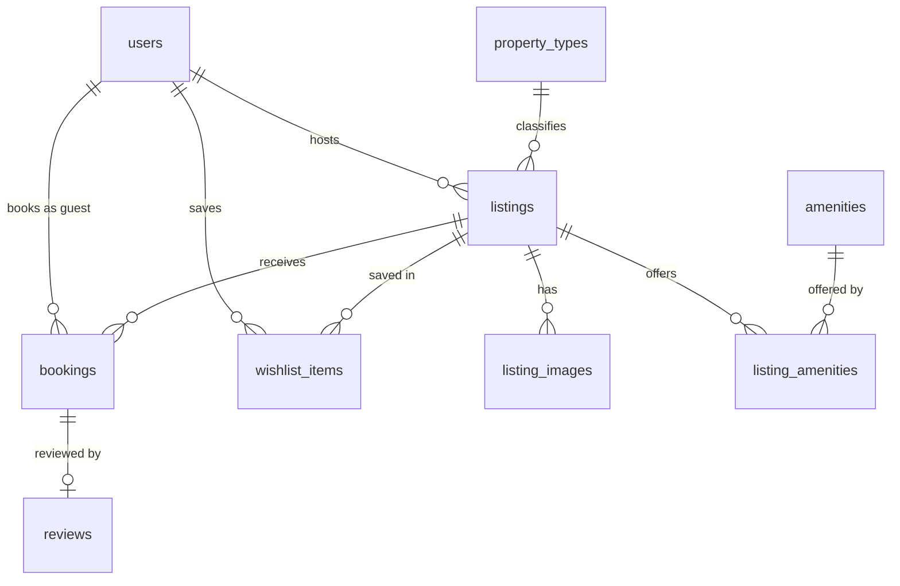

# AirStay

A home-rental marketplace: browse and search homes, view a listing, book available dates through a mocked checkout, see the booking in Trips, and manage listings as a host.

> This README is a skeleton. Sections marked _(to come)_ are completed as their phases land; the full specification is [`PROJECT_PLAN.md`](PROJECT_PLAN.md).

## Tech stack

| Layer | Choice |
|---|---|
| Frontend | Next.js 16 (App Router, Turbopack), React 19, TypeScript (strict), Tailwind CSS v4 |
| Backend | Python ≥ 3.12, FastAPI, SQLAlchemy 2 (synchronous), Pydantic v2 |
| Database | SQLite in WAL mode |
| Tooling | uv, Ruff, mypy, pytest · ESLint, `tsc`, Vitest |

## Setup

Requirements: Node.js ≥ 22.12, Python ≥ 3.12 and [uv](https://docs.astral.sh/uv/) (`pip install uv` works too).

```bash
npm run setup   # installs backend and frontend dependencies, creates the .env files
npm run seed    # builds the database and loads the sample data
npm run dev     # backend on http://localhost:8000, frontend on http://localhost:3000
```

Open http://localhost:3000.

- The browser calls the API through the frontend, at `http://localhost:3000/api/*` (for example http://localhost:3000/api/health).
- The backend itself listens on http://localhost:8000 and serves only paths under `/api`; its generated reference is at http://localhost:8000/api/docs.

| Command | Purpose |
|---|---|
| `npm run setup` | Install dependencies and create `backend/.env` and `frontend/.env.local` |
| `npm run dev` | Run backend and frontend together |
| `npm run test` | pytest and Vitest |
| `npm run check` | Ruff, mypy, pytest, ESLint, `tsc --noEmit`, Vitest, `next build` |
| `npm run seed` | Rebuild and seed the database (`-- --check-images` verifies the photo URLs instead) |
| `npm run e2e` | End-to-end journeys _(to come)_ |

### Configuration

| Variable | Used by | Local default |
|---|---|---|
| `DATABASE_URL` | backend | `sqlite:///./data/app.db` |
| `SECRET_KEY` | backend | generated by `npm run setup` |
| `SERVICE_FEE_BPS` | backend | `1500` |
| `APP_TIMEZONE` | backend | `Asia/Kolkata` |
| `SEED_ON_EMPTY` | backend | `false` |
| `COOKIE_SECURE` | backend | `false` (set `true` behind HTTPS) |
| `BACKEND_URL` | frontend, server side only | `http://localhost:8000` |

## Architecture

```
Browser ──► Next.js (:3000) ──rewrite /api/*──► FastAPI (:8000) ──► SQLite file (WAL)
```

- The browser only ever talks to the Next.js origin, so cookies are first-party and there is no CORS configuration.
- Backend layers: router → service → repository → models. Services own the transaction.
- Every mutating request runs in a transaction opened with `BEGIN IMMEDIATE`, so it holds SQLite's single write lock before reading anything. A writer that cannot get the lock within 5 s receives `503 busy`.
- Every error has one JSON shape, and every request carries a request id (`X-Request-ID`) that appears in the response, the error body and the logs.

```
backend/app/    core/ (settings, errors, logging, dependencies) · db/ (engine, sessions) · one folder per feature
frontend/       app/ (routes, in groups by header) · components/ui (primitives) · components/layout (headers, menu, login, footer)
                components/listings (card, grid) · hooks/ · lib/api/ (the only code that calls fetch) · lib/ (formatting, URL parameters)
scripts/        setup, dev and uv helpers behind the npm commands
```

### Frontend

- Pages are rendered on the server and read their state from the URL; interactive parts (header, cards, modals) are client components.
- The look is built from measurements of the original, recorded in `docs/parity-notes.md`; colours, radii and shadows are tokens in `frontend/app/globals.css`.
- Login is mocked: the "Log in or sign up" modal lists the seeded accounts. Choosing one sets a signed, HttpOnly session cookie; there is no password field anywhere.
- The typeface (Instrument Sans) is fetched from Google Fonts when the frontend is built or first run in development, then served from our own origin. Listing photos are loaded from the Unsplash CDN through the Next.js image optimiser.

## Database schema



| Table | Holds | Notable rules enforced by the database |
|---|---|---|
| `users` | People. A host is simply a user who owns a listing | Unique email; non-empty name |
| `property_types`, `amenities` | Reference data | Unique slugs; amenity category from a fixed list |
| `listings` | Homes | Price > 0; fees ≥ 0; guests, beds, bathrooms ≥ 1; coordinates both set or both empty; `pets_allowed` flag; `deleted_at` marks a removed listing |
| `listing_images` | Photo URLs in order; position 0 is the cover | Unique `(listing_id, position)`; deleted with the listing |
| `listing_amenities` | Which listing offers which amenity | Composite primary key |
| `bookings` | Stays, with a snapshot of what was charged | Valid ISO dates; `check_out > check_in`; `total = nightly × nights + cleaning + service`; unique confirmation code; unique `(guest_id, idempotency_key)` |
| `reviews` | One review per stay | Unique `booking_id`; rating 1–5 |
| `wishlist_items` | Saved listings | Composite primary key `(user_id, listing_id)` |

Design notes:

- **No double booking, guaranteed by the database.** Two triggers on `bookings` (insert and update) abort any write that would make two confirmed stays on one listing overlap. A stay is the half-open range `[check_in, check_out)`, so one guest can arrive on the day another leaves. The triggers make it impossible for any code path, script or manual SQL to break the rule. The booking endpoint checks the same rule first, inside its write transaction, so that a guest gets a clean `409 dates_unavailable` instead of a database error.
- **Money is an integer number of paise** (₹1 = 100). No floating point touches money, and every amount is a whole rupee, so displayed lines always add up.
- **Nothing derived is stored.** Ratings, review counts, "upcoming / past" and host status are computed when read. The one deliberate exception is the price snapshot on a booking: it records what was charged, and a CHECK keeps its lines and total consistent.
- **Integer columns are really integers.** SQLite will keep text in an INTEGER column, where `'abc' > 0` is true, so every integer column with a range check also has `CHECK (typeof(col) = 'integer')`.
- **Dates are ISO text** (`YYYY-MM-DD`), which sorts and compares correctly; a CHECK rejects malformed values.
- **Soft delete only for listings**, so past trips and reviews keep their references. Everything else uses real foreign keys with `RESTRICT` or `CASCADE`.
- **Indexes** serve the queries the app makes: listings by host, city, property type and price; amenity lookups; a partial index on confirmed bookings by `(listing_id, check_in, check_out)` for availability; bookings by guest for Trips.
- The schema is created from the models; there is one version and no migration tooling.

### Seed data

`npm run seed` rebuilds the database and loads 28 users (seven demo accounts; 12 of the users are hosts), 8 property types, 34 amenities, 60 listings across 12 Indian destinations, and roughly a thousand bookings and reviews. Stays are placed relative to the day you run it, so there are always past, current and upcoming trips; running it twice on the same day produces identical data. `npm run seed -- --check-images` requests every photo URL.

## API overview

Identity is a signed session cookie; "user" below means a signed-in demo account.

| Method | Path | Who | Purpose |
|---|---|---|---|
| GET | `/api/health` | anyone | Liveness, including a database query |
| GET | `/api/meta` | anyone | Property types, amenities, fee rate, guest limits, page size |
| GET | `/api/auth/demo-accounts` | anyone | Accounts offered in the login modal |
| POST | `/api/auth/login` | anyone | Start a session as a demo account: `{ "user_id": 5 }` |
| POST | `/api/auth/logout` | anyone | End the session |
| GET | `/api/auth/me` | anyone | `{ user }` with `is_host`, or `{ user: null }` |
| GET | `/api/locations?q=` | anyone | Up to eight suggestions (city, state or country) matched by word prefix, with listing counts |
| GET | `/api/listings` | anyone | Search: `location`, `check_in`, `check_out`, `adults`, `children`, `infants`, `pets`, `min_price_minor`, `max_price_minor`, `property_type` (repeatable, any), `amenity` (repeatable, all), `min_bedrooms`, `min_beds`, `min_bathrooms`, `page`, `page_size` |
| GET | `/api/listings/summary` | anyone | Count, price range and histogram for the same filters |
| GET | `/api/listings/{id}` | anyone | Detail: photos, amenities, host, rating |
| GET | `/api/listings/{id}/reviews` | anyone | Paginated reviews |
| GET | `/api/listings/{id}/availability` | anyone | Booked date ranges in a window (`from`, `to`) |
| GET | `/api/listings/{id}/quote` | anyone | Price breakdown for dates and guests |
| POST | `/api/listings` | user | Create a listing; the host is the signed-in user |
| PATCH | `/api/listings/{id}` | owner | Partial update |
| DELETE | `/api/listings/{id}` | owner | Remove; refused while reservations are upcoming |
| GET | `/api/hosting/listings` | user | The caller's listings |
| POST | `/api/bookings` | user | Book a stay; needs an `Idempotency-Key` header (a UUID) |
| GET | `/api/bookings` | user | The caller's trips |
| GET | `/api/bookings/{id}` | its guest or the listing's host | Reservation detail |
| GET | `/api/hosting/reservations` | user | Reservations on the caller's listings; `status`, `listing_id` filters |
| GET | `/api/wishlist`, `/api/wishlist/ids` | user | Saved listings as cards; their ids |
| PUT / DELETE | `/api/wishlist/{listing_id}` | user | Save / unsave (idempotent) |

Money is always integer paise with `currency: "INR"`; dates are `YYYY-MM-DD`.

### How a booking is made

`POST /api/bookings` runs in one transaction that takes SQLite's write lock before reading anything, so two guests cannot both see the dates as free. In order: the idempotency key is looked up (a repeat of the same request returns the first booking with 200); the listing must exist; the guest must not be its host; dates and guest counts are validated; overlap with confirmed stays is checked; the price is computed on the server and compared with the total the guest saw (`409 price_changed` with the new quote if they differ); the mock payment is charged (`402 payment_declined` for the declining test card); the booking is inserted with a snapshot of the price. Any failure rolls everything back.

| Status | Codes |
|---|---|
| 401 | `unauthenticated` |
| 402 | `payment_declined` |
| 403 | `cannot_book_own_listing`, `not_listing_owner` |
| 404 | `listing_not_found`, `booking_not_found`, `demo_account_not_found` |
| 409 | `dates_unavailable`, `price_changed`, `listing_has_upcoming_reservations` |
| 422 | `validation_error`, `invalid_dates`, `invalid_guest_count`, `idempotency_key_reused` |
| 503 | `busy` (the write lock was not obtained in time; retry) |

Error shape:

```json
{ "error": { "code": "not_found", "message": "Not found.", "details": {}, "request_id": "…" } }
```

## Assumptions and limitations

_(to come)_
