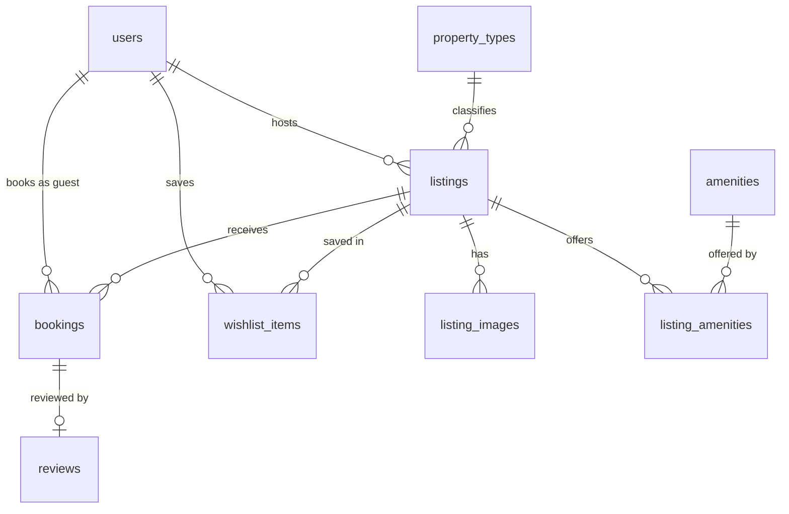

# AirStay

A home-rental marketplace: browse and search homes, view a listing, book available dates through a mocked checkout, see the booking in Trips, and manage listings as a host.

> This README is a skeleton. Sections marked _(to come)_ are completed as their phases land; the full specification is [`PROJECT_PLAN.md`](PROJECT_PLAN.md).

## Tech stack

| Layer | Choice |
|---|---|
| Frontend | Next.js 16 (App Router, Turbopack), React 19, TypeScript (strict), Tailwind CSS v4 |
| Backend | Python ≥ 3.12, FastAPI, SQLAlchemy 2 (synchronous), Pydantic v2 |
| Database | SQLite in WAL mode |
| Tooling | uv, Ruff, mypy, pytest · ESLint, `tsc`, Vitest |

## Setup

Requirements: Node.js ≥ 22.12, Python ≥ 3.12 and [uv](https://docs.astral.sh/uv/) (`pip install uv` works too).

```bash
npm run setup   # installs backend and frontend dependencies, creates the .env files
npm run seed    # builds the database and loads the sample data
npm run dev     # backend on http://localhost:8000, frontend on http://localhost:3000
```

Open http://localhost:3000.

- The browser calls the API through the frontend, at `http://localhost:3000/api/*` (for example http://localhost:3000/api/health).
- The backend itself listens on http://localhost:8000 and serves only paths under `/api`; its generated reference is at http://localhost:8000/api/docs.

| Command | Purpose |
|---|---|
| `npm run setup` | Install dependencies and create `backend/.env` and `frontend/.env.local` |
| `npm run dev` | Run backend and frontend together |
| `npm run test` | pytest and Vitest |
| `npm run check` | Ruff, mypy, pytest, ESLint, `tsc --noEmit`, Vitest, `next build` |
| `npm run seed` | Rebuild and seed the database (`-- --check-images` verifies the photo URLs instead) |
| `npm run e2e` | End-to-end journeys _(to come)_ |

### Configuration

| Variable | Used by | Local default |
|---|---|---|
| `DATABASE_URL` | backend | `sqlite:///./data/app.db` |
| `SECRET_KEY` | backend | generated by `npm run setup` |
| `SERVICE_FEE_BPS` | backend | `1500` |
| `APP_TIMEZONE` | backend | `Asia/Kolkata` |
| `SEED_ON_EMPTY` | backend | `false` |
| `BACKEND_URL` | frontend, server side only | `http://localhost:8000` |

## Architecture

```
Browser ──► Next.js (:3000) ──rewrite /api/*──► FastAPI (:8000) ──► SQLite file (WAL)
```

- The browser only ever talks to the Next.js origin, so cookies are first-party and there is no CORS configuration.
- Backend layers: router → service → repository → models. Services own the transaction.
- Every mutating request runs in a transaction opened with `BEGIN IMMEDIATE`, so it holds SQLite's single write lock before reading anything. A writer that cannot get the lock within 5 s receives `503 busy`.
- Every error has one JSON shape, and every request carries a request id (`X-Request-ID`) that appears in the response, the error body and the logs.

```
backend/app/    core/ (settings, errors, logging, dependencies) · db/ (engine, sessions) · one folder per feature
frontend/       app/ (routes) · lib/api/ (the only code that calls fetch) · lib/config.ts
scripts/        setup, dev and uv helpers behind the npm commands
```

## Database schema



| Table | Holds | Notable rules enforced by the database |
|---|---|---|
| `users` | People. A host is simply a user who owns a listing | Unique email; non-empty name |
| `property_types`, `amenities` | Reference data | Unique slugs; amenity category from a fixed list |
| `listings` | Homes | Price > 0; fees ≥ 0; guests, beds, bathrooms ≥ 1; coordinates both set or both empty; `deleted_at` marks a removed listing |
| `listing_images` | Photo URLs in order; position 0 is the cover | Unique `(listing_id, position)`; deleted with the listing |
| `listing_amenities` | Which listing offers which amenity | Composite primary key |
| `bookings` | Stays, with a snapshot of what was charged | Valid ISO dates; `check_out > check_in`; `total = nightly × nights + cleaning + service`; unique confirmation code; unique `(guest_id, idempotency_key)` |
| `reviews` | One review per stay | Unique `booking_id`; rating 1–5 |
| `wishlist_items` | Saved listings | Composite primary key `(user_id, listing_id)` |

Design notes:

- **No double booking, guaranteed by the database.** Two triggers on `bookings` (insert and update) abort any write that would make two confirmed stays on one listing overlap. A stay is the half-open range `[check_in, check_out)`, so one guest can arrive on the day another leaves. The API checks the same rule first to give a clean error; the triggers make it impossible for any other code path, script or manual SQL to break it.
- **Money is an integer number of paise** (₹1 = 100). No floating point touches money, and every amount is a whole rupee, so displayed lines always add up.
- **Nothing derived is stored.** Ratings, review counts, "upcoming / past" and host status are computed when read. The one deliberate exception is the price snapshot on a booking: it records what was charged, and a CHECK keeps its lines and total consistent.
- **Dates are ISO text** (`YYYY-MM-DD`), which sorts and compares correctly; a CHECK rejects malformed values.
- **Soft delete only for listings**, so past trips and reviews keep their references. Everything else uses real foreign keys with `RESTRICT` or `CASCADE`.
- **Indexes** serve the queries the app makes: listings by host, city, property type and price; amenity lookups; a partial index on confirmed bookings by `(listing_id, check_in, check_out)` for availability; bookings by guest for Trips.
- The schema is created from the models; there is one version and no migration tooling.

### Seed data

`npm run seed` rebuilds the database and loads 20 users (seven demo accounts), 8 property types, 35 amenities, 60 listings across 12 Indian destinations, about 1,060 bookings and 970 reviews. Stays are placed relative to the day you run it, so there are always past, current and upcoming trips; running it twice on the same day produces identical data. `npm run seed -- --check-images` requests every photo URL.

## API overview

| Method | Path | Purpose |
|---|---|---|
| GET | `/api/health` | Liveness, including a database query |

_(the remaining endpoints to come)_

Error shape:

```json
{ "error": { "code": "not_found", "message": "Not found.", "details": {}, "request_id": "…" } }
```

## Assumptions and limitations

_(to come)_
